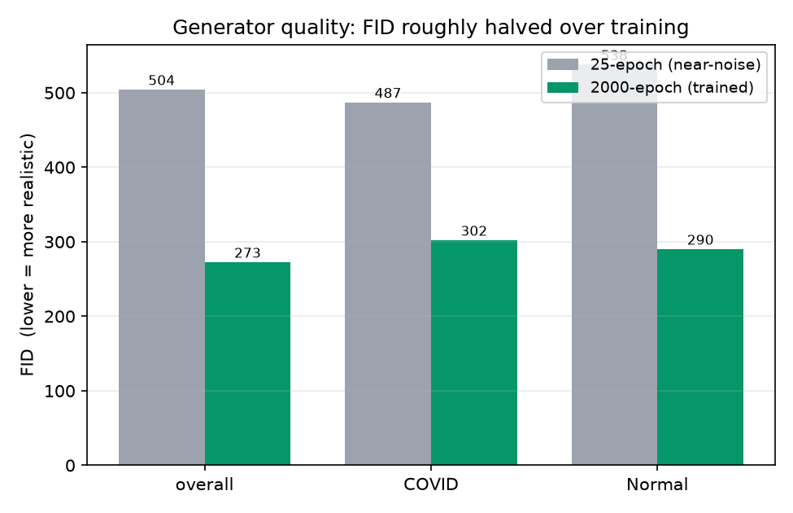
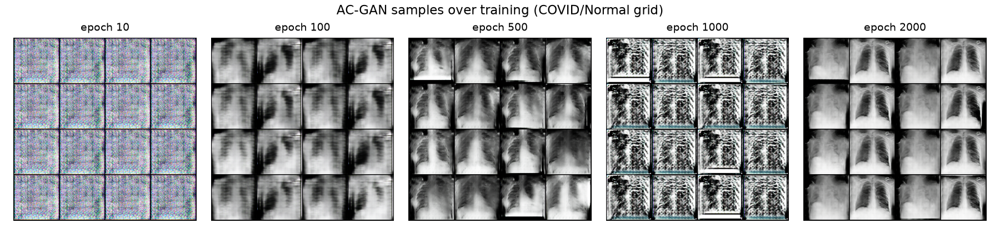

# CovidGAN — Paper Reconstruction and Improvement

**Final Project, Part 2.** Reconstruction and improvement of Waheed, Goyal, Gupta,
Khanna, Al-Turjman, Pinheiro, *"CovidGAN: Data Augmentation Using Auxiliary
Classifier GAN for Improved Covid-19 Detection"*, IEEE Access, vol. 8, 2020.

This is the **unified report** for both stages. **Stage 1** reconstructs the
paper's AC-GAN + VGG16 COVID-19 detector and reproduces its main result;
**Stage 2** improves the architecture and shows the effect in a
paper / reconstruction / improved table. A large part of the work was
**experimental investigation** — the reconstruction produced two results that did
not match the paper, and most of Stage 1 is a sequence of controlled tests that
diagnose *why*. Those tests also directly motivated the Stage 2 design.

It follows the required report structure (1 Original architecture · 2 Paper
results · 3 Reconstruction results · 4 Improved architecture · 5 Improved results
· 6 Discussion · 7 References). It consolidates every test and improvement from
the two detailed working logs — `FINDINGS.md` (Stage 1) and
`stage2/STAGE2_FINDINGS.md` (Stage 2) — which remain in the repo as the long-form
appendices. Numbers behind every table live in `stage2/results/`.

---

## 1. Original architecture

The paper's pipeline has two models: an **AC-GAN** that synthesizes chest-X-ray
(CXR) images, and a **VGG16-based classifier** that detects COVID-19. Synthetic
images from the GAN augment the classifier's training set.

### 1.1 AC-GAN generator (`covidgan/models.py`)
- **Inputs:** a class label `c ∈ {COVID, Normal}` and a noise vector `z ∈ ℝ¹⁰⁰`
  (`z ~ N(0, 0.02)`, per the paper).
- **Label branch:** `Embedding(2→50) → Dense → 7×7×1` map.
- **Noise branch:** `Dense(100 → 1024·7·7) → ReLU → 7×7×1024`.
- **Body:** concatenate to `7×7×1025`, then four `5×5` stride-2 transpose-conv
  blocks (BatchNorm + ReLU), upsampling `7→14→28→56→112`, `Tanh` on the final
  layer → `112×112×3` image in `[-1, 1]`. (~22M params.)

### 1.2 AC-GAN discriminator
- Five `3×3` conv blocks (BatchNorm / LeakyReLU(0.2) / Dropout(0.5)),
  `112×112×3 → 7×7×512`, then **two heads**: a validity head (real/fake) and a
  class head (COVID/Normal) — the defining feature of an AC-GAN. (~2M params.)

### 1.3 Classifier (`build_classifier`)
- **Frozen ImageNet VGG16** convolutional base →
  `GlobalAveragePool → Dense(64, ReLU) → Dropout(0.5) → Dense(2)`.
- Only the head trains (~33K params); the VGG16 base is frozen, matching the
  paper: *"…setting the 'trainable' property on each of the VGG layers to False
  before training."*

### 1.4 Losses / objective
- **GAN:** `BCEWithLogits` on the validity head + `CrossEntropy` on the class
  head, for both D and G (standard AC-GAN objective). One-sided label smoothing
  (real target 0.9).
- **Classifier:** `CrossEntropy`.

### 1.5 Key hyperparameters (paper's)
- GAN: batch 64, Adam `lr=2e-4`, `β₁=0.5`, **2000 epochs**.
- Classifier: batch 16, Adam `lr=1e-3`, image size `112×112`, pixels in `[0,1]`.
- Data split (paper): train COVID/Normal 331/601, **test 72/120 (192 total)**.

### 1.6 Faithfulness of the reconstruction (layer-by-layer)
The implementation was audited component-by-component against the paper's
Figs. 1–3 and Sec. II–III before any result was interpreted:

| Component | Specification (matches paper) | Params | Source |
|---|---|---|---|
| **Generator** | Noise branch `z_dim=100` (Fig. 3) → Dense → 7×7×1024; label branch `Embedding(50)` → Dense → 7×7×1; concat → four 5×5 stride-2 transpose-conv blocks (7→14→28→56→112), BatchNorm+ReLU, `Tanh` last | ~22M | `covidgan/models.py:26` |
| **Discriminator** | Five 3×3 conv blocks (BatchNorm / LeakyReLU(0.2) / Dropout(0.5)), 112→7×7×512, **two heads** (validity + class) = AC-GAN | ~2M | `covidgan/models.py:76` |
| **Classifier** | Frozen ImageNet VGG16 base → GAP → Dense(64, ReLU) → Dropout(0.5) → Dense(2) | ~14.7M total, **only ~33K trainable** | `covidgan/models.py:113` |

The frozen backbone is **faithful to the paper, not a shortcut we introduced**
(paper Sec. II-B: *"…without updating the weights of VGG16 layers … setting the
'trainable' property … to False"*). This matters because it means the anomalies in
§3 must be **data / training-regime effects**, not implementation bugs.

> **Note on the noise dimension.** An earlier exploratory pass used a 20,000-d
> noise vector, which inflates the first generator layer past 20M params on its
> own and does not match Fig. 3 (which labels the noise-branch dense input
> `?×100`). The models here use `z_dim=100`.

---

## 2. Paper results

The paper's headline metric is **classification accuracy** on a held-out set of
**192 real** CXRs (72 COVID + 120 Normal), in two configurations:

- **CNN-AD** — classifier trained on **real** data only ("actual data").
- **CNN-SA** — classifier trained on **real + GAN-synthesized** data.

| Configuration | Accuracy |
|---|---|
| CNN-AD (real only) | **85%** |
| CNN-SA (+ synthetic) | **95%** |

The paper's central claim is the **+10-point** lift from GAN augmentation,
concentrated in **COVID recall** — its CNN-AD misses **~22 of 72** COVID cases
(recall ≈ 0.69).

**Metric meanings.**
- **Accuracy** (paper's metric) = correct / total on the 192-image real test set.
- **Per-class recall** (metric studied in class) = TP / (TP+FN) per class — the
  fraction of true COVID (resp. Normal) cases caught. In screening, missing COVID
  matters more than raw accuracy, so recall is the clinically meaningful axis.
- **FID** (Fréchet Inception Distance; metric studied in class, for the
  *generator*) = Fréchet distance between InceptionV3 feature distributions of
  real vs. synthetic images; **lower = more realistic**. Accuracy alone cannot
  judge image quality; FID can.

We reproduce accuracy exactly and additionally report precision / recall / F1 /
specificity and the confusion matrix (the paper's Table 1 / Fig. 6–7 layout),
implemented in `classification_table` (`covidgan/metrics.py:11`).

---

## 3. Reconstruction results (Stage 1)

We reimplemented the full pipeline in PyTorch, trained the GAN for the paper's
**2000 epochs**, generated a synthetic pool (1669 COVID + 1399 Normal = 3068
images), and evaluated CNN-AD / CNN-SA on the 192-image real test set.

| Configuration | Paper | Our reconstruction |
|---|---|---|
| CNN-AD (real only) | 85.00% | **90.62%** |
| CNN-SA (+ synthetic) | 95.00% | **90.10%** |
| Augmentation lift | +10.00 | **−0.52 (flat)** |

This produced **two anomalies**: (A) our baseline is *higher* than the paper's
(90.6% vs 85%), and (B) augmentation was **flat**, not +10. A faithful
reconstruction that beats the paper *and* fails to reproduce its main claim
demands explanation, so we ran a sequence of controlled tests. Each is stated
below as **hypothesis → method → result → verdict**.

Where the gap lives — COVID recall:

| | Accuracy | COVID recall | COVID missed (of 72) |
|---|---|---|---|
| **Paper CNN-AD** | 85.42% (164/192) | 0.69 | 22 |
| **Our CNN-AD** | **91.15% (175/192)** | **0.89** | **8** |

Normal recall is essentially saturated in both, so "why do we beat the paper?" is
precisely "**why do we catch far more COVID cases?**"

### 3.1 Test 1 — Architecture faithfulness (is it a bug?)
- **Hypothesis:** the anomalies are an implementation error (e.g. we accidentally
  trained the whole VGG16, or mismatched the generator).
- **Method:** audit every layer against the paper's Figs. 1–3 and Sec. II–III
  (see §1.6); confirm the VGG16 base is frozen and only the ~33K-param head
  trains; verify generator param count and the `7→14→28→56→112` upsampling path.
- **Result:** the implementation matches the paper, including the frozen backbone.
  Trainable params = 33K, as intended.
- **Verdict:** **not a bug.** The anomalies are real effects to be explained, not
  artifacts — so the cause must be in the *data* or the *training regime*.

### 3.2 Test 2 — Cross-source shortcut (same-source A/B)
- **Hypothesis (for anomaly A):** the high baseline is a *cross-source shortcut*.
  In the standard pipeline COVID images come from one dataset (IEEE
  `covid-chestxray-dataset`) and Normal from another, so a classifier can separate
  them on **non-pathological** cues (scanner, resolution, borders, brightness,
  embedded text) rather than lung pathology — a well-known failure mode of early
  COVID-CXR classifiers.
- **Method:** build a **single-source** split where *both* classes are drawn from
  one dataset's per-class subfolders (Kaggle COVID-19 Radiography Database's
  `COVID/` and `Normal/`), so both pass through one acquisition + processing
  pipeline (`load_same_source`, `covidgan/data.py:80`; wired via `--same-source-root`).
  Subsample to the paper's scale (403 COVID + 721 Normal), keep the paper's test
  counts (72/120). Retrain CNN-AD.
- **Result:** same-source CNN-AD **still scored 91.15%** — removing the
  cross-source path did not collapse accuracy toward 85%.
- **Verdict:** the cross-source shortcut is **not** the main driver. (Reassuring:
  the strong baseline is not the classic different-scanner artifact.)

### 3.3 Test 3 — Coarse-resolution shortcut (Experiment 9a)
- **Hypothesis (for anomaly A):** even within one source, the model might cheat on
  *coarse / global* properties (overall brightness, framing, gross silhouette)
  rather than reading fine pathology.
- **Method:** downsample each image to `N×N` (area interpolation), then upsample
  back to 112 (bilinear) — destroying fine anatomical detail while preserving
  coarse structure. Retrain CNN-AD at each `N`. Majority-class floor
  (guess all-Normal) = 120/192 = **62.5%**.

  | Input detail | Accuracy | COVID recall |
  |---|---|---|
  | 112 (full) | 89.58% | 0.83 |
  | 32×32 | 83.85% | 0.64 |
  | 16×16 | 82.29% | 0.61 |
  | 8×8 | 77.08% | 0.51 |
  | 4×4 | 73.96% | 0.51 |
- **Result:** accuracy **decays steadily** (−16 pts from full→4×4) and COVID
  recall roughly **halves** (0.83→0.51). A *pure coarse shortcut* would hold near
  89% even at 8×8 (brightness/framing survive downsampling); instead accuracy
  collapses, and collapses **specifically on COVID**. But 4×4 (16 pixels, no
  anatomy) still clears the 62.5% floor by ~11 pts, so a **small coarse residual**
  exists.
- **Verdict:** the model is **mostly detail-dependent** (reads real fine/mid-scale
  pathology), with only a small coarse residual — not a coarse shortcut.

### 3.4 Test 4 — Synthetic-only probe (do the fake images carry pathology?)
- **Hypothesis (for anomaly B):** maybe the synthetic images look class-correct
  but carry no transferable COVID signal, so they can't help the classifier.
- **Method:** train a classifier on the **synthetic pool alone**, then evaluate on
  the **real** test set. If the synthetic class signal is real pathology, real
  accuracy should clear the 62.5% floor.
- **Result:** the classifier reached ~100% on synthetic *train* but only
  **55.21%** on real test (COVID recall **0.22**) — **below** the 62.5% floor.
- **Verdict:** the synthetic class signal is essentially a **label-conditioned
  fingerprint** (the AC-GAN embeds class via the label branch) carrying ~zero
  transferable pathology. This explains why synthetic augmentation can't *add*
  pathology signal — but does not yet explain why it doesn't even hurt (see 3.6).

**Supporting diagnostics for Test 4.**
- **High CNN-SA *train* accuracy (~99%) is not evidence of good images.** Synthetic
  images are **77%** of the training set (932 real + 3068 synthetic); an AC-GAN
  imprints a class-conditioned signature via the label embedding, so synthetic
  COVID vs. Normal are trivially separable — inflating *train* accuracy regardless
  of realism.
- **Why CNN-SA never collapses**, even on poor images: the frozen backbone limits
  corruption to ~33K params, and the synthetic images occupy their own region of
  VGG16 feature space (PCA, `covidgan/metrics.py:95`), so they barely perturb the
  real decision boundary.

### 3.5 Test 5 — Generator quality over training (FID)
- **Hypothesis (for anomaly B):** augmentation is flat because the GAN images are
  simply too poor (near-noise).
- **Method:** compute **FID** (real test set vs. synthetic pool) for an early
  25-epoch "smoke" GAN and the full 2000-epoch GAN (`evaluate_fid.py`).

  | Set | 25-epoch | 2000-epoch | Change |
  |---|---|---|---|
  | overall | 504.4 | **272.7** | −46% |
  | COVID | 487.2 | 302.2 | −38% |
  | Normal | 538.0 | 290.2 | −46% |
- **Result:** FID roughly **halved** — the 2000-epoch generator produces
  meaningfully more CXR-like images. (In absolute terms ~273 is still high — a good
  FID is single/low-double digits — partly the upward bias of a small real set
  of 72–120 images against InceptionV3's 2048-dim features, which `evaluate_fid.py`
  warns about, and partly genuine: 2000 epochs on 403 COVID images at 112×112 yields
  *plausible*, not photorealistic, CXRs.) Yet (Test 6) CNN-SA did **not** improve
  when fed these better images.
- **Verdict — the decisive one:** if image *quality* were the lever, a 2× FID
  improvement should have produced *some* downstream lift; it produced none.
  **Image quality is not what caps augmentation.**





### 3.6 Combined diagnosis of the two anomalies
- **Anomaly A (high baseline):** not cross-source (3.2), not a coarse shortcut
  (3.3). Most consistent explanation: the **modern Kaggle dataset is cleaner,
  larger, and more separable** than the paper's 2020 hand-merged set, so our
  detector does legitimate but *easier* classification — the improvement sits
  exactly in COVID recall (0.69→0.89).
- **Anomaly B (flat augmentation):** FID halved with zero downstream change
  (3.5), so it is **not** image quality. The cause is the **frozen VGG16 head** —
  with the backbone frozen, only ~33K linear params train, so synthetic images
  can only nudge a boundary on top of *fixed* features; they cannot reshape what
  the network looks at. And because the frozen backbone limits corruption to those
  33K params, the poor synthetic signal (3.4) can't hurt either — hence *flat*.

**This diagnosis is the bridge to Stage 2:** the blocker is the frozen head, so
the improvement must *unfreeze capacity where augmentation can act.*

### 3.7 Open caveat (not yet closed)
Test 3 rules out *coarse* shortcuts but **not** a **fine-scale, dataset-specific
artifact** (a rescaling-kernel signature, JPEG/compression fingerprint, or faint
watermark). Such an artifact lives in fine detail, would **also vanish under
downsampling**, and so would masquerade as detail-dependence in the 3.3 table.
The decisive test is **cross-dataset validation** (Experiment 9b): evaluate CNN-AD
on an **independent** public dataset (both classes, non-overlapping with
Kaggle/IEEE). The IEEE set cannot serve — it is one of the *sources* of the Kaggle
COVID class and has no Normal class. A truly independent third dataset is required;
**9b has not been run.**

### 3.8 Reproducibility / performance engineering
The original scripts selected the compute device with only
`torch.cuda.is_available()`, so on Apple-silicon Macs they **silently ran on CPU**
(the M-series GPU sat idle), and the dataset was **re-decoded and re-resized every
epoch**. Two fixes:

- **`pick_device`** (`covidgan/models.py:135`) — prefers **cuda > mps > cpu**, so
  M-series Macs use the Metal GPU.
- **In-RAM dataset cache** (`CXRDataset(cache=True)`, `covidgan/data.py:189`;
  default-on in both trainers, e.g. `train_classifier.py:154`) — every image is
  decoded and resized **once** at construction, so each epoch reads pre-made
  tensors.

**Effect.** CNN-AD training dropped from **~19 min to ~1 min** on an M4. A Colab
**T4 had been no faster than the laptop** because the GPU was starved by CPU image
decoding; caching removes that bottleneck, making the full **2000-epoch GAN run
practical on a free Colab GPU**. The 2000-epoch run itself took ~18 h on MPS
(~55 min / 100 epochs), checkpointing every 100 epochs with optimizer state and a
`--resume` flag for interruption-safety; the epoch-2000 generator is committed at
`weights/covidgan_generator_final.pt`.

---

## 4. Improved architecture (Stage 2)

All Stage 2 code is in the separate `stage2/` package; the Stage 1 code is
unchanged and only imported for its data/metrics utilities. Two coupled changes,
chosen to directly address the Stage 1 diagnosis (§3.6) and both drawn from the
assignment's list of allowed modifications:

| # | Change | Assignment category | Where |
|---|---|---|---|
| 1 | **Unfreeze the top VGG16 conv block(s)** — domain fine-tuning of the encoder | "Change the encoder" | `stage2/model.py` |
| 2 | **Add BatchNorm to the head** (`Dense(64) → BatchNorm1d → ReLU → Dropout → Dense(2)`) | "Add normalization layers" | `stage2/model.py` |

Trained with **discriminative learning rates** — fresh head at `1e-3`, unfrozen
pretrained backbone at `1e-5` — so ImageNet filters are gently adapted, not
destroyed on ~900 images.

We report **two variants** to show the effect of how much encoder capacity we
unlock:

| Variant | Top blocks fine-tuned | Trainable params |
|---|---|---|
| Stage 1 (baseline) | 0 (frozen) | 33K |
| **Stage 2 / uf=1** | 1 | 7.11M |
| **Stage 2 / uf=2** | 2 | 13.01M |

**Why we expected improvement.** This is a *direct consequence of the Stage 1
analysis*, not a guess. Stage 1 isolated the blocker as the frozen head (FID
halved yet CNN-SA did not move). Unfreezing the top block(s) (a) adapts ImageNet
features to CXR texture — raising the baseline — and (b) makes the features
*trainable*, so synthetic data can reshape them, reviving the augmentation effect
the frozen model could not exploit. Both predictions are tested in Section 5.

---

## 5. Improved results (Stage 2)

Same 192-image real test set throughout, so all rows are comparable. Below, the
core result table, then the tests that validate and characterize it.

### 5.1 Main result — paper / reconstruction / improved
Stage 2 rows are **mean ± std over 5 seeds** (`stage2/multiseed.py`,
`stage2/results/multiseed_uf{1,2}.json`); paper and Stage 1 are single runs.

| Model | CNN-AD (real only) | CNN-SA (+ synthetic) | Augmentation lift |
|---|---|---|---|
| **Paper** (Waheed et al. 2020) | 85.00% | 95.00% | +10.00 |
| **Stage 1 reconstruction** (frozen) | 90.62% | 90.10% | −0.52 (flat) |
| **Stage 2 improved / uf=1** (1 block + BN) | 92.50% ± 0.71 | 93.65% ± 1.16 | **+1.15** |
| **Stage 2 improved / uf=2** (2 blocks + BN) | **94.48% ± 0.97** | **96.67% ± 0.71** | **+2.19** |

COVID recall (where the gap lives):

| Model | CNN-AD | CNN-SA | Recall lift |
|---|---|---|---|
| Stage 2 / uf=1 | 88.89% ± 1.76 | 91.39% ± 1.62 | +2.50 |
| Stage 2 / uf=2 | 93.33% ± 3.22 | 96.67% ± 2.08 | +3.33 |

**Both predictions confirmed:** the baseline rose (90.6→94.5%) *and* augmentation
now helps. At uf=2, **CNN-SA (96.67%) exceeds the paper's 95%.**


### 5.2 Test 6 — Multi-seed robustness + capacity ablation
- **Hypothesis:** a single-run "+1.5 points" could be seed noise; and more
  unlocked capacity should give more room for augmentation.
- **Method:** retrain both arms from scratch for **5 seeds** each, at uf=1 and
  uf=2 (`stage2/multiseed.py`), reporting mean ± std of accuracy and COVID recall.
- **Result:** the lift is consistent across seeds (uf=2: +2.19 acc, +3.33 recall),
  and the COVID-recall lift **exceeds each arm's seed spread** — a real effect,
  not noise. uf=2 beats uf=1 on both baseline and lift.
- **Verdict:** the augmentation effect is statistically robust, and encoder
  capacity is the knob that controls its size.

### 5.3 Test 7 — Data-scarcity curve (why is our lift smaller than +10?)
- **Hypothesis:** our full-data lift (~+2) is smaller than the paper's +10 because
  our baseline is near ceiling; the paper's +10 came from a **data-starved 85%**.
  Augmentation should therefore help *more* as real data shrinks.
- **Method:** subsample the **real** training set (stratified) to 10/25/50/100%
  while keeping the **full** synthetic pool fixed; compare CNN-AD vs CNN-SA at each
  fraction (uf=2, 3 seeds; `stage2/data_scarcity.py`).

  | real frac | n_real | CNN-AD | CNN-SA | acc lift | recall lift |
  |---|---|---|---|---|---|
  | 0.10 | 93 | 86.98% | 89.24% | +2.26 | +1.39 |
  | 0.25 | 233 | 89.58% | 92.88% | **+3.30** | +4.63 |
  | 0.50 | 466 | 91.32% | 93.06% | +1.74 | +0.93 |
  | 1.00 | 932 | 93.92% | 96.01% | +2.08 | +1.39 |

  
- **Result:** the baseline degrades monotonically as data shrinks (93.9→87.0%),
  and augmentation helps at **every** level (+1.7 to +3.3), **largest in the
  low-to-mid regime** (peak +3.30 at 25%).
- **Verdict:** supports the paper's "augmentation rescues data-starved models"
  thesis *directionally*. Honest caveat: not perfectly monotonic, and the 10%
  point is noisy (only 93 images; its 3 seeds ran +4.17/−1.04/+3.65), so we frame
  it as "consistently positive, strongest at low-to-mid data," not "monotonic."

### 5.4 Test 8 — Generalization curve (are we overfitting? should we stop earlier?)
- **Hypothesis:** train accuracy hits ~100% within ~10 epochs, so maybe the model
  overfits and we should stop earlier.
- **Method (bias-safe):** the reported models use a **fixed 15 epochs chosen
  test-blind**. Separately, a *diagnostic* run logs per-epoch **test** accuracy
  (`stage2/diagnostic_curve.py`, 25 epochs) — **for analysis only; not used to
  select the epoch**, since choosing the epoch by test score would be selecting on
  the test set and would bias the result.
- **Result:** train saturates ≥99% by epoch 3–6, yet **test accuracy never
  degrades** through 25 epochs (AD plateau ≈93.7% ±0.76, SA ≈96.5%, drifting
  slightly up). SA's curve sits above AD's at essentially every epoch. The
  single-epoch "peaks" (AD 95.83%@24, SA 97.40%@6) are random noise spikes at
  different epochs.

  
- **Verdict:** **no harmful overfitting** — train saturation ≠ test degradation.
  "Train longer" neither helps much nor hurts; fixed 15 epochs sits on the
  plateau. Early stopping is unnecessary here; proper *validation*-based early
  stopping (never on the test set) is noted as a future refinement. The noise-spike
  peaks concretely illustrate *why* tuning the epoch on test would be biased.

---

## 6. Discussion

**What worked.** Stage 2 did exactly what the Stage 1 diagnosis predicted:
unfreezing the encoder raised the baseline *and* revived GAN augmentation,
restoring the paper's core finding that the faithful frozen reconstruction could
not reproduce. The tests make the story quantitative rather than assertive — each
alternative explanation (cross-source, coarse shortcut, bad image quality, seed
noise) was tested and ruled in or out.

**What did not.** We did not reproduce the paper's **+10-point** magnitude — not a
failure of the method but of *available headroom*: our ~94.5% baseline on cleaner
modern data cannot gain 10 points, whereas the paper started at 85%. The
data-scarcity curve confirms this reading: the lift grows as the baseline weakens.

**What we learned.** The CovidGAN augmentation benefit is **real but contingent**
on (a) the classifier having trainable capacity to absorb new data and (b) the
baseline not already being at ceiling. Freezing the backbone or starting from an
easy high baseline both suppress it. Three regimes on identical data — frozen
(Stage 1), uf=1, uf=2 — plus the scarcity sweep make this mechanism explicit.

**Limitations / future work.** Results are 5-seed (full data) / 3-seed (scarcity)
means; the extreme-scarce point is noisy. One Stage 1 caveat remains open (§3.7): a
possible Kaggle-specific fine-scale artifact could still inflate the baseline —
Test 3 rules out *coarse* shortcuts but not a fine fingerprint that would also
vanish under downsampling. It is testable only by validating on an **independent**
public CXR dataset (both classes, non-overlapping), which we did not run.
Validation-based early stopping is a further refinement.

---

## 7. References

1. A. Waheed, M. Goyal, D. Gupta, A. Khanna, F. Al-Turjman, P. R. Pinheiro,
   "CovidGAN: Data Augmentation Using Auxiliary Classifier GAN for Improved
   Covid-19 Detection," *IEEE Access*, vol. 8, pp. 91916–91923, 2020.
2. A. Odena, C. Olah, J. Shlens, "Conditional Image Synthesis with Auxiliary
   Classifier GANs," *ICML*, 2017.
3. K. Simonyan, A. Zisserman, "Very Deep Convolutional Networks for Large-Scale
   Image Recognition" (VGG16), *ICLR*, 2015.
4. M. Heusel, H. Ramsauer, T. Unterthiner, B. Nessler, S. Hochreiter, "GANs
   Trained by a Two Time-Scale Update Rule Converge to a Local Nash Equilibrium"
   (FID), *NeurIPS*, 2017.
5. T. Rahman, M. E. H. Chowdhury et al., "COVID-19 Radiography Database," Kaggle.
   (Real CXR dataset used for reconstruction.)
6. J. P. Cohen, P. Morrison, L. Dao, "COVID-19 Image Data Collection"
   (ieee8023/covid-chestxray-dataset). (A source of the COVID class.)

---

## Appendix A — How to reproduce

**Stage 1 (reconstruction).**
```bash
# 1. Train CovidGAN (generator + discriminator), paper's 2000 epochs
python train_gan.py --manifest data/manifest.csv --out-dir runs/gan
# 2. Sample the trained generator into the synthetic augmentation pool
python generate_synthetic.py --checkpoint runs/gan/checkpoints/covidgan_final.pt \
    --out-dir data/synthetic
# 3. Baseline: CNN on real data only (CNN-AD)
python train_classifier.py --manifest data/manifest.csv --mode ad --out-dir runs/cnn_ad
# 4. Augmented: CNN on real + synthetic (CNN-SA)
python train_classifier.py --manifest data/manifest.csv --mode sa \
    --synthetic-dir data/synthetic --out-dir runs/cnn_sa
# FID (generator quality)
python evaluate_fid.py --real-manifest data/manifest.csv --synthetic-dir data/synthetic
```

**Stage 2 (improved model).**
```bash
# improved model, both arms (uf=2 shown; use --unfreeze-blocks 1 for uf=1)
python -m stage2.train_stage2 --mode ad --unfreeze-blocks 2 --out-dir runs/stage2_cnn_ad
python -m stage2.train_stage2 --mode sa --unfreeze-blocks 2 --synthetic-dir data/synthetic \
    --out-dir runs/stage2_cnn_sa
# multi-seed AD-vs-SA (mean ± std) — run for uf=1 and uf=2
python -m stage2.multiseed --seeds 0 1 2 3 4 --unfreeze-blocks 1 --out-root runs/stage2_multiseed
python -m stage2.multiseed --seeds 0 1 2 3 4 --unfreeze-blocks 2 --out-root runs/stage2_multiseed_uf2
# supporting analyses
python -m stage2.data_scarcity --fractions 0.1 0.25 0.5 1.0 --seeds 0 1 2 --unfreeze-blocks 2
python -m stage2.diagnostic_curve --unfreeze-blocks 2 --epochs 25   # diagnostic only
# assemble the paper / reconstruction / improved table
python -m stage2.compare_results
```

Ablations: `--unfreeze-blocks {0..5}` (0 = Stage 1 behaviour + BN head);
`--no-head-bn` drops the BatchNorm.

---

*Code: Stage 1 in `covidgan/`, `train_gan.py`, `train_classifier.py`,
`generate_synthetic.py`, `evaluate_fid.py`. Stage 2 in `stage2/`. Trained
generator weights in `weights/covidgan_generator_final.pt`. Detailed working logs:
`FINDINGS.md` (Stage 1), `stage2/STAGE2_FINDINGS.md` (Stage 2). Dataset: Kaggle
COVID-19 Radiography Database (link in `README.md`).*
