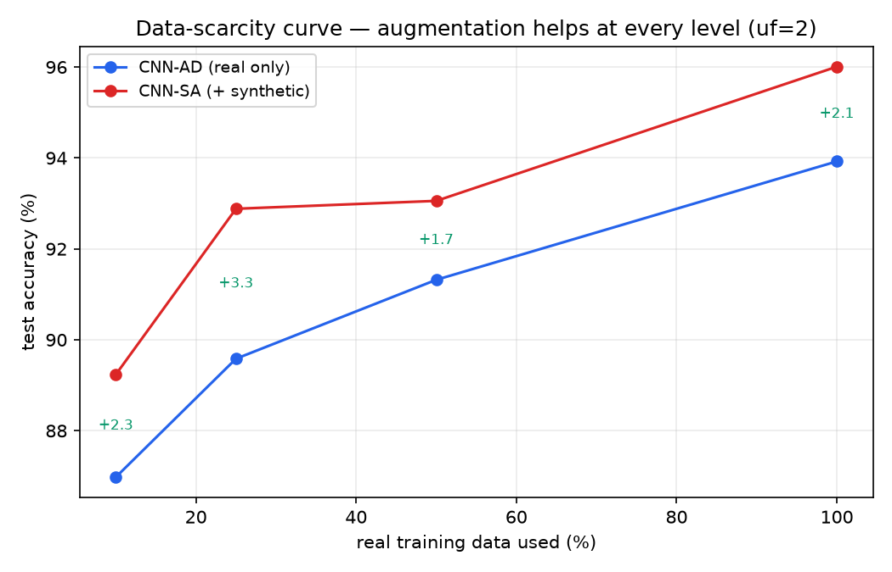
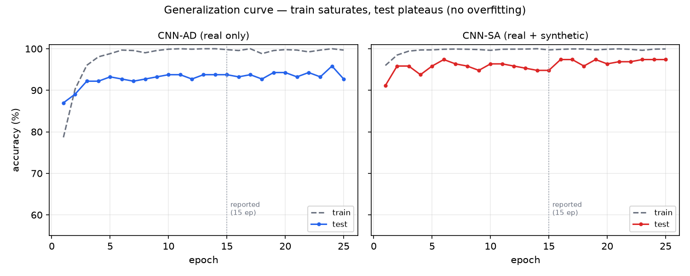

# Reproducing, Diagnosing, and Rescuing the CovidGAN Claim
### — Validated on a Second Dataset —
**Final Project, Part 2 — Joint Report**

Reconstruction, diagnosis, and improvement of Waheed, Goyal, Gupta, Khanna, Al-Turjman, Pinheiro, *"CovidGAN: Data Augmentation Using Auxiliary Classifier GAN for Improved Covid-19 Detection"*, IEEE Access, vol. 8, 2020.

**Contributors.** Hila Fishman · Maya Hayat

> **Editing note.** Callouts wrapped as **⚠️ COVID GAP** mark places where the second dataset (DDSM) currently carries a test at higher power than the primary COVID dataset yet leads (single-seed or missing on COVID) — i.e. work to bring back onto the main line. In the LaTeX these are the `\covidgap{}` orange boxes.

**This is the unified joint report.** CovidGAN is the main project and **leads every experiment**: we reconstruct the paper's AC-GAN + VGG16 COVID-19 detector faithfully and find that its **central claim — a +10-point accuracy lift from GAN augmentation — does not reproduce**. Our first hypothesis for *why* was the **data**: the modern Kaggle CXR set we use is cleaner and more separable than the paper's 2020 hand-merged set, which could give a baseline so high that augmentation has nothing left to add. But that is a claim about *our particular dataset*, not about the method — and the way to test it is to **run the whole pipeline again on a completely different dataset**. So the project runs on two tracks: (1) diagnose and fix the claim on the COVID data (the main line, §3–§5); (2) **replicate the same experiments on a second, independent dataset** — CBIS-DDSM benign-vs-malignant mammography (§6) — to check whether each COVID conclusion is data-specific or general. Both tracks converge: the paper's naive setup fails on *both* datasets (so the failure is *not* an artifact of our cleaner COVID data), the same fixes rescue a real-but-smaller benefit on each, and both independently surface the same counter-intuitive phenomenon — **a generator that is better by every quality metric (FID, transfer, stability) can make the downstream classifier worse**.

**How to read this report.** CovidGAN is the primary dataset and **leads every main experiment**; each states the COVID result first, then a *"Second dataset (DDSM)"* check of whether the same conclusion holds on independent data (consolidated in §6, with pointers from each COVID test). A callout marked **⚠️ COVID GAP** flags the places where the second dataset currently carries a test at *higher* power than the primary COVID dataset yet leads (single-seed or missing on COVID) — i.e. work to bring back onto the main line. Throughout, we treat each test as *support for or against* a hypothesis, not as proof. The report follows the required structure (Original architecture, Paper results, Reconstruction results, Improved architecture, Improved results, Discussion, References), with the second-dataset replication and a short reproduce-commands section before the references. Numbers behind every CovidGAN table live in `stage2/results/`; DDSM numbers are from Weights & Biases (`maya-hayat-ariel-university/ddsm-acgan`).

---

## Table of contents

1. [Original architecture](#1-original-architecture)
2. [Paper results](#2-paper-results)
3. [Reconstruction results (Stage 1)](#3-reconstruction-results-stage-1)
4. [Improved architecture (Stage 2)](#4-improved-architecture-stage-2)
5. [Improved results (Stage 2)](#5-improved-results-stage-2)
6. [Second dataset — replicating the experiments on DDSM](#6-second-dataset--replicating-the-experiments-on-ddsm)
7. [Stage 2 — combining the two datasets](#7-stage-2--combining-the-two-datasets)
8. [Discussion](#8-discussion)
9. [Reproducing the results](#9-reproducing-the-results)
10. [References](#references)

---

## 1. Original architecture

The paper's pipeline has two models: an **AC-GAN** that synthesizes chest-X-ray (CXR) images, and a **VGG16-based classifier** that detects COVID-19. Synthetic images from the GAN augment the classifier's training set.

Figure 1 sketches the three components at a block level; the exact layer-by-layer specification (with parameter counts and source lines) is in Table 1.

> **Figure 1.** Block view of the three models. **(a)** The generator fuses a noise vector and a class label, then upsamples 7→112 through four transpose-conv blocks (~22M params). **(b)** The discriminator downsamples an image to 7×7×512 and splits into the two AC-GAN heads — validity and class (~2M params). **(c)** The detector is a *frozen* ImageNet VGG16 base with a small trainable head; only ~33K of ~14.7M params train (grey = frozen). *(Rendered as a TikZ diagram in the LaTeX version.)*

**Generator.** Inputs are a class label *c* ∈ {COVID, Normal} and a noise vector *z* ∈ ℝ¹⁰⁰ (*z* ~ 𝒩(0, 0.02), per the paper). A label branch (Embedding→Dense) and a noise branch (Dense→ReLU) are concatenated to 7×7×1025 and upsampled by four 5×5 stride-2 transpose-conv blocks (BatchNorm+ReLU, tanh on the last) to a 112×112×3 image in [−1, 1]. (~22M params.)

**Discriminator.** Five 3×3 conv blocks (BatchNorm / LeakyReLU(0.2) / Dropout(0.5)) downsample the image to 7×7×512, which feeds **two heads** — a validity head (real/fake) and a class head (COVID/Normal). The class head is what makes this an *auxiliary-classifier* GAN. (~2M params.)

**Classifier (`build_classifier`).** A **frozen** ImageNet VGG16 convolutional base feeds GlobalAveragePool → Dense(64, ReLU) → Dropout(0.5) → Dense(2). Only the head trains (~33K params); the VGG16 base is frozen, matching the paper: *"…setting the 'trainable' property on each of the VGG layers to False before training."*

### Losses / objective

- **GAN:** `BCEWithLogits` on the validity head + `CrossEntropy` on the class head, for both *D* and *G* (standard AC-GAN objective). One-sided label smoothing (real target 0.9).
- **Classifier:** `CrossEntropy`.

### Key hyperparameters (paper's)

- GAN: batch 64, Adam lr = 2e−4, β₁ = 0.5, **2000 epochs**.
- Classifier: batch 16, Adam lr = 1e−3, image size 112×112, pixels in [0, 1].
- Data split (paper): train COVID/Normal 331/601, **test 72/120 (192 total)**.

### Faithfulness of the reconstruction (layer-by-layer)

The implementation was audited component-by-component against the paper's Figs. 1–3 and Sec. II–III before any result was interpreted:

**Table 1. Layer-by-layer specification, audited against the paper.**

| Component | Specification (matches paper) | Params | Source |
|---|---|---|---|
| Generator | Noise branch `z_dim=100` (Fig. 3) → Dense → 7×7×1024; label branch Embedding(50) → Dense → 7×7×1; concat → four 5×5 stride-2 transpose-conv blocks (7→14→28→56→112), BatchNorm+ReLU, tanh last | ~22M | `models.py:26` |
| Discriminator | Five 3×3 conv blocks (BatchNorm / LeakyReLU(0.2) / Dropout(0.5)), 112→7×7×512, **two heads** (validity + class) = AC-GAN | ~2M | `models.py:76` |
| Classifier | Frozen ImageNet VGG16 base → GAP → Dense(64, ReLU) → Dropout(0.5) → Dense(2) | ~14.7M total, **only ~33K trainable** | `models.py:113` |

The frozen backbone is **faithful to the paper, not a shortcut we introduced** (paper Sec. II-B: *"…without updating the weights of VGG16 layers … setting the 'trainable' property … to False"*). This matters because it means the anomalies in §3 must be **data / training-regime effects**, not implementation bugs.

**Note on the noise dimension.** An earlier exploratory pass used a 20,000-d noise vector, which inflates the first generator layer past 20M params on its own and does not match Fig. 3 (which labels the noise-branch dense input ?×100). The models here use `z_dim=100`.

---

## 2. Paper results

The paper's headline metric is **classification accuracy** on a held-out set of **192 real** CXRs (72 COVID + 120 Normal), in two configurations: **CNN-AD** (classifier trained on **real** data only, "actual data") and **CNN-SA** (trained on **real + GAN-synthesized** data).

| Configuration | Accuracy |
|---|---|
| CNN-AD (real only) | **85%** |
| CNN-SA (+ synthetic) | **95%** |

The paper's central claim is the **+10-point** lift from GAN augmentation, concentrated in **COVID recall** — its CNN-AD misses ~22 of 72 COVID cases (recall ≈ 0.69).

**Metric meanings.**

- **Accuracy** (paper's metric) = correct / total on the 192-image real test set.
- **Per-class recall** (metric studied in class) = TP / (TP+FN) per class — the fraction of true COVID (resp. Normal) cases caught. In screening, missing COVID matters more than raw accuracy, so recall is the clinically meaningful axis.
- **FID** (Fréchet Inception Distance; metric studied in class, for the *generator*) = Fréchet distance between InceptionV3 feature distributions of real vs. synthetic images; **lower = more realistic**. Accuracy alone cannot judge image quality; FID can.

We compute accuracy the same way the paper does (on the same 192-image real test split) and additionally report precision / recall / F1 / specificity and the confusion matrix (the paper's Table 1 / Fig. 6–7 layout), implemented in `classification_table` (`covidgan/metrics.py:11`).

---

## 3. Reconstruction results (Stage 1)

We reimplemented the full pipeline in PyTorch, trained the GAN for the paper's **2000 epochs**, generated a synthetic pool (1669 COVID + 1399 Normal = 3068 images), and evaluated CNN-AD / CNN-SA on the 192-image real test set.

| Configuration | Paper | Our reconstruction |
|---|---|---|
| CNN-AD (real only) | 85.00% | **90.62%** |
| CNN-SA (+ synthetic) | 95.00% | **90.10%** |
| Augmentation lift | +10.00 | **−0.52 (flat)** |

Up front: **we did not reproduce the paper's headline +10 augmentation lift as-is.** Instead the reconstruction produced **two anomalies**: (A) our baseline is *higher* than the paper's (90.6% vs 85%), and (B) augmentation came out **flat**, not +10. Rather than treat this as a dead end, we used it as the object of study: the rest of Stage 1 is a sequence of controlled tests that try to explain both anomalies, and those tests motivate the Stage 2 design (which, as §5 shows, does recover a positive lift). Each test is stated as **hypothesis → method → result → verdict**; a test can *support* or *weaken* a hypothesis, not prove it.

Where the gap lives — COVID recall:

| | Accuracy | COVID recall | COVID missed (of 72) |
|---|---|---|---|
| Paper CNN-AD | 85.42% (164/192) | 0.69 | 22 |
| Our CNN-AD | **90.62% (174/192)** | **0.89** | **8** |

Normal recall is essentially saturated in both, so "why is our baseline higher?" is largely "**why do we catch more COVID cases?**" (8 missed vs 22).

### Test 1 — Architecture faithfulness (is it a bug?)

- **Hypothesis:** the anomalies are an implementation error (e.g. we accidentally trained the whole VGG16, or mismatched the generator).
- **Method:** audit every layer against the paper's Figs. 1–3 and Sec. II–III (see §1 Faithfulness); confirm the VGG16 base is frozen and only the ~33K-param head trains; verify generator param count and the 7→14→28→56→112 upsampling path.
- **Result:** the implementation matches the paper, including the frozen backbone. Trainable params = 33K, as intended.
- **Verdict:** we found no implementation error, so the anomalies are most likely real effects to be explained — pointing to the *data* or the *training regime* rather than a coding bug.

### Test 2 — Cross-source shortcut (same-source A/B)

- **Hypothesis (anomaly A):** the high baseline is a *cross-source shortcut*. In the **multi-source pipeline we first reconstructed** (the repo's default: COVID images drawn from the IEEE `covid-chestxray-dataset` and Normal images from the Kaggle Radiography Database), the two classes come from *different* datasets, so a classifier could separate them on **non-pathological** cues (scanner, resolution, borders, brightness, embedded text) rather than lung pathology — a well-known failure mode of early COVID-CXR classifiers.
- **Method:** build a **single-source** split where *both* classes are drawn from one dataset's per-class subfolders (Kaggle COVID-19 Radiography Database's `COVID/` and `Normal/`), so both pass through one acquisition + processing pipeline (`load_same_source`, `covidgan/data.py:80`). Subsample to the paper's scale (403 COVID + 721 Normal), keep the paper's test counts (72/120). Retrain CNN-AD.
- **Result:** same-source CNN-AD **also landed at ≈91%** — essentially unchanged from the 90.62% baseline. Forcing both classes through one source did not collapse accuracy toward 85%.
- **Verdict:** this **weakens** the cross-source-shortcut explanation — if that shortcut were the main driver, forcing a single source should have pulled accuracy down, and it did not. So the strong baseline is probably not just the classic different-scanner artifact (though this one test cannot rule out every cross-source effect).

### Test 3 — Coarse-resolution shortcut (Experiment 9a)

- **Hypothesis (anomaly A):** even within one source, the model might cheat on *coarse / global* properties (overall brightness, framing, gross silhouette) rather than reading fine pathology.
- **Method:** downsample each image to N×N (area interpolation), then upsample back to 112 (bilinear) — destroying fine anatomical detail while preserving coarse structure. Retrain CNN-AD at each N. Majority-class floor (guess all-Normal) = 120/192 = **62.5%**.

| Input detail | Accuracy | COVID recall |
|---|---|---|
| 112 (full) | 89.58% | 0.83 |
| 32×32 | 83.85% | 0.64 |
| 16×16 | 82.29% | 0.61 |
| 8×8 | 77.08% | 0.51 |
| 4×4 | 73.96% | 0.51 |

- **Result:** accuracy **decays steadily** (−16 pts from full→4×4) and COVID recall roughly **halves** (0.83→0.51). A *pure coarse shortcut* would hold near 89% even at 8×8 (brightness and framing survive aggressive downsampling); instead accuracy collapses, and collapses **specifically on COVID**. That pattern is what we would expect if the model mostly reads *fine* anatomical detail.
- **What the 4×4 point means.** Even at 4×4 (16 pixels — no anatomy is left) accuracy is still ~11 pts above the 62.5% floor. So a small amount of class information survives in the *coarsest* image statistics. This is a residual, non-anatomical cue — plausibly overall brightness/exposure or framing, or a dataset marker that survives blurring (an embedded letter/logo, a border). We cannot tell which from this test; we only note that it is small.
- **Verdict:** the result is **most consistent with a mostly detail-dependent model** (reading real fine/mid-scale pathology), plus a small coarse residual — i.e. it *argues against*, but does not by itself disprove, a coarse global shortcut.

### Test 4 — Synthetic-only probe (do the fakes carry pathology?)

- **Hypothesis (anomaly B):** maybe the synthetic images look class-correct but carry no transferable COVID signal, so they can't help.
- **Method:** train a classifier on the **synthetic pool alone**, then evaluate on the **real** test set. If the synthetic class signal is real pathology, real accuracy should clear the 62.5% floor.
- **Result:** the classifier reached ~100% on synthetic *train* but only **55.21%** on real test (COVID recall **0.22**) — *below* the 62.5% majority-class floor. A model that has only ever seen synthetic X-rays does *worse than guessing all-Normal* on real ones, calling most real COVID cases Normal.
- **Verdict:** in isolation the synthetic class signal is not just useless but mildly *misleading* — the AC-GAN stamps an easy class-conditioned signature through its label branch, and that signature is recoverable *within* the synthetic set but does not match (and even cuts against) the features that separate real COVID from real Normal. This signature is **plainly visible to the eye** in Figure 2: the synthetic COVID tiles are *conspicuously brighter* than the Normal ones — a whole-image style difference anyone can spot at a glance, which is exactly *not* how real pathology presents.
- **Reproduced on the second dataset:** DDSM's synthetic-only probe and PCA analysis show the same failure — naive synthetic samples carry little transferable signal and sit outside the real class's feature region (§6).

**Is this a contradiction with Test 3?** No — and the two are worth reading together, because they concern *different images*. Test 3 is about the classifier reading **real** X-rays: blurring them collapses accuracy and COVID recall, so the model depends on *fine* detail that is genuinely present in real images (real pathology). Test 4 is about the generator's **synthetic** images: a model trained only on them fails on real data, so the fakes do *not* contain that fine pathology — only the coarse brightness tag of Figure 2. Far from conflicting, the two results *reinforce* each other and jointly explain the flat augmentation: the real task is won on fine detail (Test 3), and the fakes supply only a coarse global tag instead of that detail (Test 4), so the synthetic images are missing precisely the signal the classifier relies on.

**Does this mean "the GAN didn't work", or that the fakes "confuse" the classifier?** It is worth being precise, because two different things are true at once:

- As an *image generator* the GAN partly worked: it learned to produce images that *look like* chest X-rays (Test 5: FID roughly halved, ribcage and lung fields become visible). It did not learn to make the COVID/Normal difference match real pathology.
- Trained *alone*, those labels mislead (the result above). But in the actual augmentation setup — synthetic *mixed with* real (CNN-SA) — the outcome is **flat, not worse**. If the fakes genuinely *confused* the detector, CNN-SA would drop *below* CNN-AD; it does not. With the frozen backbone the synthetic images fall in their own region of feature space (PCA below), so the real data still fixes the boundary and the fakes are largely *ignored* rather than fighting it.

So the accurate summary of anomaly B is: the synthetic labels are *uninformative* for real classification (ignored when pooled in), and only *misleading* when they are the sole signal — not that they actively confuse the mixed-data model. (Why the frozen backbone makes them ignorable is taken up in [Combined diagnosis](#combined-diagnosis-of-the-two-anomalies).)

**A better way to use the synthetic data (future work).** Our setup, like the paper's, simply *pools* synthetic and real images. Your intuition — *learn the CXR "image world" from the fakes first, then finetune on real* — is a genuinely different recipe (pretrain-then-finetune / curriculum) and is worth trying. Note it only makes sense once the encoder is *trainable*: in Stage 1 the backbone is frozen, so "pretraining" would touch only the 33K head that finetuning on real would overwrite. In Stage 2 (unfrozen) it is a concrete alternative to pooling that could extract the weak-but-real low-level structure the generator did learn while discarding its spurious label fingerprint. We did not run it; we flag it in §8.

**Supporting diagnostics.** (i) *High CNN-SA train accuracy (~99%) is not evidence of good images*: synthetic images are **77%** of the training set (932 real + 3068 synthetic); an AC-GAN imprints a class-conditioned signature via the label embedding, so synthetic COVID vs. Normal are trivially separable, inflating *train* accuracy regardless of realism. (ii) *Why CNN-SA never collapses*, even on poor images: the frozen backbone limits corruption to ~33K params, and the synthetic images occupy their own region of VGG16 feature space (PCA, `covidgan/metrics.py:95`), so they barely perturb the real decision boundary.


> **Figure 2. The fingerprint, seen.** 2000-epoch AC-GAN samples: the COVID tiles (columns 1 & 3) are uniformly *brighter* and hazier than the darker, sharper Normal tiles (columns 2 & 4), so the classes are separable by a *global brightness style* rather than localized pathology — exactly the useless-but-present class signature the synthetic-only probe detects (55% on real, below floor). The generator did learn to look like a chest X-ray (visible ribcage/lung fields; its FID also halves over training, Test 5), it just did not learn the *class* difference as real pathology. We quantify this "fingerprint" in [Track B results](#track-b-results--killing-the-fingerprint-and-the-downstream-paradox) (real class-mean brightness differs by only ~3.5%, yet the GAN turned it into a deterministic rule).

### Test 5 — Generator quality over training (FID)

- **Hypothesis (anomaly B):** augmentation is flat because the GAN images are simply too poor (near-noise).
- **Method:** compute **FID** (real test set vs. synthetic pool) for an early 25-epoch "smoke" GAN and the full 2000-epoch GAN (`evaluate_fid.py`).

| Set | 25-epoch | 2000-epoch | Change |
|---|---|---|---|
| overall | 504.4 | **272.7** | −46% |
| COVID | 487.2 | 302.2 | −38% |
| Normal | 538.0 | 290.2 | −46% |

- **Result:** FID roughly **halved** — the 2000-epoch generator produces meaningfully more CXR-like images. (In absolute terms ~273 is still high — a good FID is single/low-double digits — partly the upward bias of a small real set of 72–120 images against InceptionV3's 2048-dim features, and partly genuine: 2000 epochs on 403 COVID images at 112×112 yields *plausible*, not photorealistic, CXRs.) Yet (Test 6) CNN-SA did **not** improve when fed these better images.
- **Verdict (our strongest evidence on anomaly B):** if image *quality* were the main lever, a 2× FID improvement should have produced *some* downstream lift; it produced essentially none. We read this as fairly strong evidence that **image quality is not what caps augmentation here** — though FID is an imperfect proxy on so few real images, so we treat it as strong support, not proof.

> **Figure.** FID roughly halved between the 25-epoch and 2000-epoch generators, overall and per class — consistent with the generator learning CXR-like structure. `stage2/results/figures/fid_drop.png`

### Multi-seed check — is the "flat" result just one unlucky run?

The main table above compares a single CNN-AD run to a single CNN-SA run, and a 0.5-point difference on 192 images is one test image, so on its own it could be noise. To check, we retrained the *faithful Stage 1 classifier* (frozen VGG16, plain head — no Stage 2 changes) from scratch for 3 seeds in both modes (`stage1_multiseed.py`; summary in `runs/stage1_multiseed/summary.json`).

| Frozen Stage 1, 3 seeds | Accuracy | COVID recall |
|---|---|---|
| CNN-AD (real only) | 91.15% ± 0.43 | 89.81% ± 0.65 |
| CNN-SA (+ synthetic) | 91.32% ± 0.25 | 87.04% ± 1.73 |
| Augmentation lift | **+0.17** | −2.78 |

The accuracy lift (+0.17) is *smaller than the seed-to-seed spread* (±0.3–0.4), i.e. statistically indistinguishable from zero — so "flat" is a robust description, not a one-run fluke. If anything COVID recall drifts slightly *down* (−2.78, within a couple of images), the opposite of the paper's "augmentation raises COVID recall" story. Bottom line: in the frozen Stage 1 model, pooling synthetic data gives **no reliable accuracy gain**.

### Combined diagnosis of the two anomalies

- **Anomaly A (high baseline):** the tests *weaken* the two obvious shortcut explanations — cross-source (Test 2) and coarse-global (Test 3). The explanation we find most consistent with the evidence is that the **modern Kaggle data is cleaner, larger, and more separable** than the paper's 2020 hand-merged set, so our detector is doing legitimate but *easier* classification; the gain sits in COVID recall (0.69→0.89). We cannot fully rule out a residual dataset artifact (see [Open caveat](#open-caveat)).
- **Anomaly B (flat augmentation):** FID halved with essentially no downstream change (Test 5), which points away from image quality as the cause. The explanation we favour is the **frozen VGG16 head**: with the backbone frozen, only ~33K linear params train, so synthetic images can only nudge a boundary on top of *fixed* features rather than reshape them. The same frozen backbone also limits how much the weak synthetic signal (Test 4) can *hurt* — which is consistent with the observed *flat* (neither helping nor hurting) result.

This reading points directly to Stage 2: if the frozen head is the blocker, the natural thing to try is to *unfreeze some capacity where augmentation could act* — which is exactly what we test next. (This is a hypothesis to test, not a settled conclusion; §5 checks whether it holds.)

### Open caveat

Test 3 argues against a *coarse* shortcut but cannot rule out a **fine-scale, dataset-specific artifact** (a rescaling-kernel signature, JPEG/compression fingerprint, or faint watermark). Such an artifact would live in fine detail, would *also* vanish under downsampling, and so would look just like detail-dependence in the Test 3 table. We flag this as the main open question about anomaly A; how it could be settled is discussed under future work (§8).

### How the models were run

The GAN was trained for the paper's full **2000 epochs** (batch 64, Adam `lr=2e-4`, β₁=0.5), which took roughly **18 hours** on an Apple-silicon GPU (MPS), checkpointing every 100 epochs so the run is interruption-safe; the epoch-2000 generator is saved at `weights/covidgan_generator_final.pt`. Each detector (CNN-AD / CNN-SA) trains in about a minute on the same hardware. The pipeline also runs on a free Colab GPU.

---

## 4. Improved architecture (Stage 2)

All Stage 2 code is in the separate `stage2/` package; the Stage 1 code is unchanged and only imported for its data/metrics utilities. Stage 1 surfaced *two* distinct bottlenecks, so we improve the architecture on two fronts:

- **Track A — the classifier** (anomaly B, the frozen head): unfreeze the encoder so augmentation has something to act on (below).
- **Track B — the generator** (the weak synthetic signal of Test 4): fix the parts of the GAN that suppress diversity and encourage a pathology-free "label fingerprint" (below).

All the changes are drawn from the assignment's list of allowed modifications ("change the encoder," "add normalization layers," "improve the generator / discriminator," "add regularization," "change the latent dimension").

### Track A — fine-tune the classifier encoder

Two coupled changes to the detector, addressing the Stage 1 diagnosis:

| # | Change | Assignment category | Where |
|---|---|---|---|
| 1 | Unfreeze the top VGG16 conv block(s) — domain fine-tuning of the encoder | "Change the encoder" | `stage2/model.py` |
| 2 | Add BatchNorm to the head (Dense(64) → BatchNorm1d → ReLU → Dropout → Dense(2)) | "Add normalization layers" | `stage2/model.py` |

Trained with **discriminative learning rates** — fresh head at 1e−3, unfrozen pretrained backbone at 1e−5 — so ImageNet filters are gently adapted, not destroyed on ~900 images. We report **two variants** to show the effect of how much encoder capacity we unlock:

| Variant | Top blocks fine-tuned | Trainable params |
|---|---|---|
| Stage 1 (baseline) | 0 (frozen) | 33K |
| Stage 2 / uf=1 | 1 | 7.11M |
| Stage 2 / uf=2 | 2 | 13.01M |

**Why we expected improvement.** This follows from the Stage 1 analysis rather than being an arbitrary tweak. Stage 1 pointed to the frozen head as the likely blocker (FID halved yet CNN-SA did not move). Unfreezing the top block(s) should (a) let the encoder adapt ImageNet features to CXR texture — which we expect to raise the baseline — and (b) make the features *trainable*, so synthetic data can reshape them and the augmentation effect can reappear. Both are predictions to be checked, not foregone conclusions; we test them next.

### Track B — improve the generator

Track A gives the classifier capacity to *use* good synthetic data, but Test 4 showed the synthetic data itself is weak — it carries little transferable pathology. Reading the Stage 1 generator code turned up concrete, likely reasons, which motivate a set of standard GAN fixes.

**What is wrong with the Stage 1 generator.**

- **The noise is nearly switched off.** Stage 1 samples the latent as *z* ~ 𝒩(0, 0.02) (`covidgan/models.py`, `sample_z`). With a std of 0.02 the noise vector barely varies, so the generator's output is driven almost entirely by the *class label*, not by *z*. That crushes sample diversity (a direct cause of the high FID) and makes the class the dominant axis of variation — exactly the "label fingerprint" Test 4 detected. Notably 0.02 is the classic DCGAN *weight-initialisation* std, so this looks like a reconstruction slip (an init constant applied to the noise). The standard choice is *z* ~ 𝒩(0, 1).
- **The AC-GAN objective rewards that fingerprint.** The auxiliary class head lets the generator satisfy its class loss by stamping an easy, separable marker rather than learning real COVID/Normal pathology.
- **No small-data regularisation.** With only 403 COVID images the discriminator overfits within a few epochs, starving the generator of a useful gradient.

**The changes (`stage2/gan_improved.py`, `train_gan_improved.py`).**

| # | Change | Assignment category | Targets |
|---|---|---|---|
| 3 | Latent noise *z* ~ 𝒩(0, 0.02) → 𝒩(0, 1) | "change the latent dimension" | diversity / fingerprint |
| 4 | **DiffAugment** on D's real+fake inputs | "add regularization" | small-data overfitting |
| 5 | **Spectral-norm** discriminator, DCGAN weight init | "improve the discriminator" | training stability |
| 6 | **Projection discriminator** (replace the auxiliary class head with a projection inner-product) | "improve the discriminator" | fingerprint at its root |

The architecture (layer shapes, ~22M G / ~2M D params) is otherwise unchanged, so any improvement is attributable to the training recipe, not a bigger model. We evaluate **two** improved generators: (i) an *improved AC-GAN* (changes 3–5) that keeps the auxiliary class head for a controlled comparison, and (ii) a **projection discriminator** (change 6, `stage2/gan_projection.py`, Miyato et al. 2018) that removes the auxiliary classifier entirely and conditions on the label through a projection inner-product — so the discriminator no longer rewards *any* cheap class marker, attacking the fingerprint at its source. The results for both are in [Track B results](#track-b-results--killing-the-fingerprint-and-the-downstream-paradox).

**Why we expected improvement, and how we test it.** Restoring the noise scale should raise diversity (lower FID) and dilute the label fingerprint; DiffAugment should let the small-data discriminator keep giving a useful signal. We evaluate on *both* axes: FID (realism/diversity of the generator) and the downstream CNN-SA lift when the improved synthetic pool augments the *Track A* (trainable-encoder) classifier — the setting where, unlike the frozen Stage 1 model, better data can actually be used. We are explicit that these are predictions: Test 5 already showed that *quality alone* need not move the downstream number, so an FID drop is necessary but may not be sufficient.

---

## 5. Improved results (Stage 2)

Same 192-image real test set throughout, so all rows are comparable.

### Main result — paper / reconstruction / improved

Stage 2 rows are **mean ± std over 5 seeds** (`stage2/multiseed.py`, with the seed-level numbers in `stage2/results/multiseed_uf1.json` and `multiseed_uf2.json`); paper and Stage 1 are single runs.

| Model | CNN-AD (real only) | CNN-SA (+ synthetic) | Aug. lift |
|---|---|---|---|
| Paper (Waheed et al. 2020) | 85.00% | 95.00% | +10.00 |
| Stage 1 reconstruction (frozen) | 90.62% | 90.10% | −0.52 (flat) |
| Stage 2 improved / uf=1 (1 blk + BN) | 92.50% ± 0.71 | 93.65% ± 1.16 | **+1.15** |
| Stage 2 improved / uf=2 (2 blk + BN) | **94.48% ± 0.97** | **96.67% ± 0.71** | **+2.19** |

COVID recall (where the gap lives):

| Model | CNN-AD | CNN-SA | Recall lift |
|---|---|---|---|
| Stage 2 / uf=1 | 88.89% ± 1.76 | 91.39% ± 1.62 | +2.50 |
| Stage 2 / uf=2 | 93.33% ± 3.22 | 96.67% ± 2.08 | +3.33 |

**Both predictions are borne out** in these runs: the baseline rose (90.6→94.5%) *and* augmentation now helps rather than being flat. At uf=2, **CNN-SA (96.67%) edges past the paper's 95%**. We state this as a 5-seed result with the spreads shown, not as a single lucky run. *Reproduced on the second dataset:* unfreezing raises the DDSM baseline identically (66.0→69.5%) and revives augmentation there too (§6, [capacity](#replicates-experiment-4capacity-the-shared-unfreeze-two-seeds)).


> **Figure.** Paper vs reconstruction vs improved — CNN-AD (real only) vs CNN-SA (+synthetic). Stage 1 (frozen) shows no augmentation gain; both Stage 2 variants raise the baseline and restore a positive lift, with uf=2 CNN-SA edging past the paper's 95%.

### Test 6 — Multi-seed robustness + capacity ablation

- **Hypothesis:** a single-run "+1.5 points" could be seed noise; and more unlocked capacity should give more room for augmentation.
- **Method:** retrain both arms from scratch for **5 seeds** each, at uf=1 and uf=2 (`stage2/multiseed.py`). The full per-seed results are the numbers in the Main result tables (mean ± std), with raw values in `stage2/results/multiseed_uf{1,2}.json`.
- **Result:** the lift held across all 5 seeds (uf=2: +2.19 acc, +3.33 recall), and the COVID-recall lift is **larger than each arm's seed-to-seed spread** — so it is unlikely to be pure seed noise. uf=2 beat uf=1 on both baseline and lift.
- **Verdict:** within this setup the augmentation effect looks robust to seed choice, and the amount of unlocked encoder capacity appears to control its size (uf=2 > uf=1). We report it as a consistent 5-seed effect, not a formal significance test.

### Test 7 — Data-scarcity curve (why is our lift smaller than +10?)

- **Hypothesis:** our full-data lift (~+2) is smaller than the paper's +10 because our baseline is near ceiling; the paper's +10 came from a **data-starved 85%**. Augmentation should therefore help *more* as real data shrinks.
- **Method:** subsample the **real** training set (stratified) to 10/25/50/100% while keeping the **full** synthetic pool fixed; compare CNN-AD vs CNN-SA at each fraction (uf=2, 3 seeds; `stage2/data_scarcity.py`).

| real frac | n_real | CNN-AD | CNN-SA | acc lift | recall lift |
|---|---|---|---|---|---|
| 0.10 | 93 | 86.98% | 89.24% | +2.26 | +1.39 |
| 0.25 | 233 | 89.58% | 92.88% | **+3.30** | +4.63 |
| 0.50 | 466 | 91.32% | 93.06% | +1.74 | +0.93 |
| 1.00 | 932 | 93.92% | 96.01% | +2.08 | +1.39 |



> **Figure.** Data-scarcity curve: CNN-SA (red) stays above CNN-AD (blue) at every real-data fraction; the green labels are the accuracy lift.

- **Result:** the baseline degrades monotonically as data shrinks (93.9→87.0%), and augmentation helps at **every** level (+1.7 to +3.3), **largest in the low-to-mid regime** (peak +3.30 at 25%).
- **Verdict:** supports the paper's "augmentation rescues data-starved models" thesis *directionally*. Honest caveat: not perfectly monotonic, and the 10% point is noisy (only 93 images; its 3 seeds ran +4.17/−1.04/+3.65), so we frame it as "consistently positive, strongest at low-to-mid data," not "monotonic."

### Test 8 — Generalization curve (are we overfitting?)

- **Hypothesis:** train accuracy hits ~100% within ~10 epochs, so maybe the model overfits and we should stop earlier.
- **Method (bias-safe):** the reported models use a **fixed 15 epochs chosen test-blind**. Separately, a *diagnostic* run logs per-epoch **test** accuracy (`stage2/diagnostic_curve.py`, 25 epochs) — **for analysis only; not used to select the epoch**, since choosing the epoch by test score would be selecting on the test set and would bias the result.
- **Result:** train saturates ≥99% by epoch 3–6, yet **test accuracy never degrades** through 25 epochs (AD plateau ≈93.7% ±0.76, SA ≈96.5%, drifting slightly up). SA's curve sits above AD's at essentially every epoch. The single-epoch "peaks" (AD 95.83%@24, SA 97.40%@6) are random noise spikes at different epochs.



> **Figure.** Generalization curve: train accuracy (grey dashed) saturates near 100%, but test accuracy (solid) plateaus rather than degrading through 25 epochs; the fixed 15-epoch mark sits on the plateau. SA's test curve stays above AD's throughout.

- **Verdict:** we see **no sign of harmful overfitting** here — train saturation did not translate into test degradation. "Train longer" neither clearly helps nor hurts, and the fixed 15-epoch mark sits on the plateau, so early stopping was not needed for a valid result; proper *validation*-based early stopping (never on the test set) is a cleaner protocol we note for future work. The noise-spike peaks also illustrate *why* tuning the epoch on the test set would bias the result.

### Track B results — killing the fingerprint, and the downstream paradox

Track A (above) gave the classifier capacity to *use* good synthetic data. This subsection reports what Track B did to the *generator* — and a counter-intuitive result that turns out to be the project's central finding.

**The fingerprint, quantified.** The Stage 1 (2000-epoch, noise 0.02) generator made COVID samples uniformly hazy/bright and Normal samples dark/sharp, with near-zero within-class diversity (mode collapse; visible in the epoch-2000 grid, §3). But on *real* data that class difference barely exists: class-mean brightness is COVID 138.6 vs Normal 129.8 — **+8.8 / 255 (~3.5%)** — with per-image ranges (COVID 105–168, Normal 104–144) overlapping almost completely. The GAN **amplified a faint, overlapping tendency into a deterministic rule**, manufacturing a separability real X-rays do not have. That is the "label fingerprint" of Test 4, measured (`stage2/synthetic_only_probe.py`).

**The fix works: transfer rises as the fingerprint is removed.** We measure generator quality two ways — FID (realism/diversity) and a **transfer probe** (train a classifier on synthetic *alone*, test on real; floor = 62.5%, so *below* floor means the synthetic signal actively cuts against real pathology):

| Generator | FID (overall) | Transfer-probe acc. |
|---|---|---|
| Stage-1 AC-GAN, 2000 ep (noise 0.02) | 272.7 | **55.2%** (below floor — pure fingerprint) |
| Improved AC-GAN, 300 ep (noise 1.0 + DiffAug + SN) | 225.7 | 72.9% |
| Projection discriminator, 300 ep | 155.0 | 74.5% |
| **Projection discriminator, 600 ep** | **121.3** | **81.3%** (COVID recall 0.47→0.67) |

Raising the noise to 1.0 is the single biggest lever (55→73%): it breaks the deterministic one-prototype-per-class collapse. The **projection discriminator** removes the auxiliary classifier's fingerprint incentive entirely and is the best, least-fingerprinted generator — at 300 epochs it already beats the Stage-1 AC-GAN at 2000 epochs by ~43% FID (155 vs 273), and resuming it to 600 epochs reaches FID 121 with transfer 81%. **The synthetic pool now carries real, transferable signal** rather than a stamp.

**The paradox (the project's sharpest finding).** A better generator did **not** help downstream — it *hurt*. Taking the projection pool from 300→600 epochs (FID 155→121, transfer 74.5→81.3%) moved downstream accuracy the *wrong* way in both classifier regimes (single seed, only the synthetic pool changing):

| Classifier | AD (real only) | SA + Proj 300 | SA + Proj 600 |
|---|---|---|---|
| frozen | 90.62% | 90.10% | **88.54%** |
| unfrozen (uf=2) | 95.31% | 97.40% | **93.75%** |

Lower FID *and* higher transfer, yet downstream accuracy dropped in both rows — **the sharpest single piece of evidence that GAN quality metrics do not predict downstream augmentation value.** It echoes Test 5 (FID halving with no downstream lift) but is stronger: here a *more* class-faithful generator makes things *worse*. *(Single seed; the unfrozen −3.65 is ~5× the seed std, so likely real, but multi-seed confirmation is outstanding — §8.)* **This same reversal appears independently on the second dataset at two seeds, with a mechanism probe** — so DDSM currently *leads* this experiment; see §6 [reversal](#replicates-experiment-3-the-paradox--and-ddsm-leads-it) and its COVID-GAP callout.

**The two axes are complementary — and both required.** Crossing {improved AC-GAN, projection} synthetic pools against {frozen, unfrozen} classifier (single seed; the uf=2 lift itself is 5-seed confirmed at +2.19 ± 0.7 above):

| Classifier | AD | SA + AC-GAN | SA + Projection |
|---|---|---|---|
| frozen | 90.62% | 90.10% | 90.10% |
| unfrozen | 95.31% | **97.92%** | 97.40% |

Better GANs help **only when the encoder is unfrozen** (+2, reproducible across the pools); under the frozen head they stay flat. Worse: under the frozen head with *scarce* real data, even the best synthetic pool actively *hurts*, and more so as data shrinks — accuracy lift −1.9 at 100% real → −6.1 at 25% → −8.2 at 10% (frozen detector + projection pool, `stage2/data_scarcity.py --frozen`). The frozen head cannot reconcile real and synthetic features, and the scarce real set is swamped by the 3068-image synthetic pool. **So neither fix alone reproduces the paper's benefit: the GAN improvement and the capacity improvement are complementary and both necessary.**

**Conclusion on COVID.** On the original data the CovidGAN benefit is **real but contingent** — it needs a de-fingerprinted GAN *and* trainable classifier capacity *and* a non-ceiling baseline. Fixing generator quality in isolation can even make things worse. Every conclusion here is a claim about *our* COVID data; §6 re-runs the same experiments on an independent dataset to test whether they generalize or are a COVID artifact.

---

## 6. Second dataset — replicating the experiments on DDSM

**Why a second dataset — and why a replication, not a "harder task".** The one explanation the COVID tests could not rule out (anomaly A) is the *data*: we *could not perfectly recreate the paper's original COVID set* — the authors published no image-level manifest of their exact 403/721 selection, and the Kaggle Radiography Database has been re-released several times since the March-2020 snapshot they used (§8). Our best guess for the high, augmentation-proof baseline is that **the data available today is cleaner and more separable** than the paper's, so our detector does legitimate but *easier* classification. But that is a claim about *our particular dataset*, not about the method — and if the reproduction failure were really an artifact of the COVID set, it should behave *differently* on a different one. So we do not go looking for a "harder task"; we **run the whole pipeline again, unchanged, on a completely independent dataset** and check whether each COVID conclusion recurs. If the same conclusions hold on independent data, they are not an artifact of the COVID set.

That second dataset is **CBIS-DDSM** benign-vs-malignant mammography (contributed by Maya Hayat, `DDSM-ACGAN-Pytorch`) — a *static, versioned* benchmark whose labels and train/test split come from its own case CSVs (not re-randomized), so any effect is attributable to the model, not dataset drift. Mass-only scope: **1,318 real training ROIs, 378 test (231 benign / 147 malignant)**; the architecture and both improvement axes are the *same* as CovidGAN's. Two DDSM data bugs were fixed before any result below — **mask-folder contamination** (segmentation masks leaking into the image set) and **16-bit grayscale truncation** (`I;16` PNGs collapsing to near-white under `PIL.convert('RGB')`). Each subsection below states which COVID experiment it replicates.

### Replicates §3: the naive setup fails on DDSM too

With the paper's own configuration (baseline GAN + frozen classifier), augmentation does **not** help on DDSM either: real-only AD = 64.02%; frozen SA with baseline-GAN synthetic = 65.34%, with improved-GAN synthetic = 64.82% (two-seed means, below); and at matched training, baseline-GAN augmentation is *worse* than real-only (below). **The +10 claim does not transfer out-of-the-box any more than it reproduced on COVID — so the failure is not an artifact of our cleaner COVID data.**

### Replicates Experiment 4 (fingerprint / transferability)

The COVID transfer probe showed the naive synthetic pool carries no transferable pathology (55.2%, below floor; Track B results). **Holds on DDSM:** its synthetic-only probe likewise shows the naive pool carries little transferable signal, and its PCA analysis shows baseline-GAN synthetic malignant samples sitting *outside* the real-malignant feature region — the same "synthetic is off in its own corner of feature space" failure, independently reproduced.

### Replicates Experiment 5 (improving the GAN) — different recipe

On COVID we removed the fingerprint with noise 1.0 + DiffAugment + spectral norm + projection discriminator. **Holds on DDSM via a different intervention:** spectral normalization on every discriminator conv + both heads (Miyato et al. 2018) and a **kernel 5→4, stride 2** fix on the transpose-conv blocks (removing checkerboard artifacts by construction, Odena et al. 2016). Stability improved **~10–30×** (D_loss std 0.351→0.026; G_loss std 0.985→0.018), and improved-GAN synthetic malignant samples moved from *outside* the real-malignant PCA region to *overlapping* it. Matched epochs, matched synthetic composition, only the GAN architecture differing:

| GAN architecture | Epochs | Accuracy | Malig. recall | Benign recall |
|---|---|---|---|---|
| — (real only, AD) | — | 64.02% | 0.64 | 0.64 |
| baseline | 300 | **60.05%** | 0.68 | 0.55 |
| improved | 300 | **66.93%** | 0.52 | 0.76 |

Baseline-GAN augmentation (60.05%) is *worse* than real-only; improved-GAN augmentation (66.93%) beats both — a **+6.9-point** architecture gap. Same conclusion as COVID (a de-fingerprinted, more stable GAN is achievable), reached via a different intervention; the two recipes are not yet unified (§7). (The gain does not compound: 300 ep beats 600.)

### Replicates Experiment 4/capacity (the shared unfreeze), two seeds

The same "unfreeze top VGG16 blocks + BN head" intervention as Track A, crossed with three data conditions, each at **two seeds**:

| Classifier | Mode | Synthetic source | Seed 0 | Seed 1 | Mean |
|---|---|---|---|---|---|
| frozen | AD | — | 66.14% | 65.87% | 66.00% |
| frozen | SA | baseline GAN | 65.34% | 65.34% | 65.34% |
| frozen | SA | improved GAN | 65.61% | 64.02% | 64.82% |
| **unfrozen** | **AD** | — | 69.84% | 69.05% | **69.45%** |
| **unfrozen** | **SA** | baseline GAN | 70.90% | 70.63% | **70.77%** |
| **unfrozen** | **SA** | improved GAN | 65.87% | 67.46% | **66.67%** |

Reproducing across both seeds: **(1)** unfreezing raises the baseline (66.00→69.45%, +3.45) — the same capacity effect Track A found on COVID (90.6→94.5%); **(2)** with the unfrozen classifier, baseline-GAN augmentation gives DDSM's **first fully reproducible augmentation win** (70.77% > 69.45% at both seeds). **Capacity is the precondition for augmentation to help, on both datasets.**

### Replicates Experiment 3 (the paradox) — and DDSM leads it

The project's central question — does a better generator convert to a better classifier? — got its most surprising answer on both datasets. On DDSM the improved GAN *helps* at matched epochs (above) but **hurts once the classifier is unfrozen**: unfrozen SA-improved 66.67% < unfrozen SA-baseline 70.77% and < unfrozen AD 69.45%, *at both seeds* (table above). This is the *same* reversal COVID showed with the projection-600 pool (Track B results): **a generator better by every generator-side metric degrading a high-capacity classifier**, now seen independently on two datasets.

> **⚠️ COVID GAP.** On DDSM this reversal is established at **two seeds** and its mechanism was probed directly — a synthetic-only fingerprint test that *rejected* the "learnable fingerprint" explanation (the improved pool carries *more* transferable signal, not less). On COVID the same reversal is only a **single-seed** observation (projection 300 vs 600, Track B results) with **no mechanism probe**. To keep the primary dataset leading, the COVID projection-300-vs-600 downstream comparison needs multi-seed runs plus a COVID synthetic-only probe of the two pools.

### Replicates Experiment 5 (both fixes required) — at higher power

DDSM ran the analogous capacity × GAN-source grid — {frozen, unfrozen} × {real, baseline-GAN, improved-GAN} — at **two seeds** (table above), and finds the same structure Track B results found on COVID: augmentation is flat under the frozen head and only becomes a reproducible win once the classifier is unfrozen. Neither fix alone reproduces the paper's benefit.

> **⚠️ COVID GAP.** COVID's capacity × GAN-source grid (Track B results) is **single-seed**; DDSM's is **two-seed**. For the primary dataset to lead, the COVID grid should be re-run multi-seed via `stage2/multiseed.py` so its frozen/unfrozen × GAN-source cells carry error bars comparable to DDSM's.

**Note — Experiment 6 (data scarcity) was not replicated on DDSM.** The COVID data-scarcity sweep (Test 7, §5) has no second-dataset check; it is COVID-only. This is *not* a COVID gap (COVID leads it), but a second-dataset replication is noted as future work (§8).

**Replication verdict.** Every COVID conclusion that was checked on DDSM **held on independent data** — the naive claim fails, the GAN can be de-fingerprinted, capacity is the precondition for augmentation, and a better generator can hurt a capable classifier. **The failure to reproduce the paper's +10 is therefore not an artifact of our cleaner COVID dataset.** The two open items are power, not direction: the reversal and the capacity grid currently lead on DDSM (two seeds) and must be brought back onto the COVID line (the two callouts above).

---

## 7. Stage 2 — combining the two datasets

Both improvement axes have now been run on **both** datasets — but with different recipes and different statistical power, so the two lines are parallel, not yet a single controlled experiment:

| Improvement axis | CovidGAN (COVID-CXR) | DDSM (mammography) |
|---|---|---|
| GAN architecture | noise 1.0 + DiffAugment + spectral norm + **projection discriminator** (Track B); mostly single-seed | spectral norm + **kernel/stride** (§6); mostly single-run |
| Classifier capacity (unfreeze VGG + BN head) | Track A, **5-seed** | §6 capacity, **2-seed** |

The matrix is *full*, but the GAN improvements are **different interventions**, and the sharpest shared finding — **a better generator degrading a capable classifier** — currently rests on single/low-seed runs on each side (CovidGAN's projection-600 drop, DDSM's improved-GAN reversal). Combining the two is therefore about making them *one* experiment:

1. **Unify the improved-GAN recipe across datasets:** port the projection + noise-1.0 recipe (`stage2/gan_projection.py`) onto DDSM and/or DDSM's spectral-norm+kernel/stride variant onto CovidGAN, so "improved GAN" means the same thing on both sides.
2. **Run one shared grid on both datasets:** {baseline GAN, improved GAN} × {frozen, unfrozen classifier}, **multi-seed**, reporting AD-vs-SA on each test set. This directly closes the two ⚠️ COVID GAPs (§6 reversal), bringing COVID up to DDSM's power.
3. **Nail down the shared reversal:** multi-seeding the grid is exactly what confirms whether "better GAN → worse downstream" is a real cross-dataset phenomenon or two unlucky draws; if real, test the dilution hypothesis by varying the real:synthetic ratio.

The payoff is a single table — two datasets × two GAN qualities × two classifier capacities, matched protocol, error bars — stating the project's unified claim quantitatively instead of by cross-referencing two parallel logs.

---

## 8. Discussion

**What worked.** Stage 2 behaved in the direction the Stage 1 analysis predicted: unfreezing the encoder raised the baseline *and* brought back a positive augmentation effect — the paper's core finding that our faithful *frozen* reconstruction had not reproduced. Framing each step as a test (cross-source, coarse shortcut, image quality, seed noise) let us support or weaken specific explanations rather than just assert them, even where the tests are not individually conclusive.

**What did not.** We did not reproduce the paper's **+10-point** magnitude. The most likely reason is *available headroom* rather than a broken method: our ~94.5% baseline on cleaner modern data has little room to gain 10 points, whereas the paper started at 85%. The data-scarcity curve is consistent with this reading — the lift tends to grow as the baseline weakens — though that curve is itself noisy at the extreme-scarce end.

**What we learned.** Our results are consistent with the CovidGAN augmentation benefit being **real but contingent** on (a) the classifier having trainable capacity to absorb new data and (b) the baseline not already being near ceiling. Freezing the backbone, or starting from an easy high baseline, both appear to suppress it. Comparing three regimes on identical data — frozen (Stage 1), uf=1, uf=2 — plus the scarcity sweep is what lets us say this with some confidence.

**Generation quality does not predict downstream benefit — the project's strongest cross-dataset finding.** This holds on *both* datasets. On COVID, FID halved and the transfer probe rose 55→81% with *zero or negative* downstream change — and the projection-600 generator, best by every generator-side metric, made both the frozen and unfrozen classifier *worse* (Track B results). On DDSM, a 10–30× more stable, better-PCA-aligned generator *helped* at matched epochs yet *hurt* the high-capacity classifier (§6 capacity). Both datasets independently produced the same striking reversal: **a generator that is better by every generator-side metric (FID, transfer probe, loss stability, PCA alignment) making the classifier worse.** Those metrics measure the *generator*; only an AD-vs-SA comparison measures the paper's actual claim.

**The failure is not an artifact of our COVID data.** The whole reason for the second dataset was the anomaly-A hypothesis — that our high, augmentation-proof baseline came from a *cleaner, more separable* modern COVID set (§6). If that were the sole cause, the naive +10 setup should have behaved differently on independent data. It did not: it **failed on DDSM too**, and every COVID conclusion that was checked there **held on independent data** (§6). So the failure to reproduce is a property of the *method under these conditions*, not of our particular dataset. The paper's claim reproduces *in kind, not in magnitude, and only under conditions*: +2.19 on COVID (uf=2, 5-seed), and on DDSM the first reproducible win (unfrozen + baseline-GAN) plus a +6.9 matched-epoch GAN-architecture gain.

**Two knobs govern whether augmentation helps.** *Capacity:* unfreezing the encoder raised the baseline on *both* datasets and is the precondition for augmentation to help at all — frozen heads stay flat or, on scarce data, get worse. *Headroom:* the paper's +10 is a data-starved, low-baseline regime; it is reproducible *in kind but not in magnitude* on data (either dataset) that is not starved. The scarcity sweep on COVID is consistent with this: the lift grows as the baseline weakens.

**On the dataset.** We reconstructed on the paper's own cited sources, not substitutes: the paper merged three public datasets — Cohen's IEEE `covid-chestxray-dataset`, the Kaggle COVID-19 Radiography Database, and `agchung/Figure1` — and deduplicated them, with the Normal class coming from the Kaggle Radiography Database. The main deviation is *version*, not source: that Kaggle database has been re-released several times since 2020 and is now much larger and cleaner than the March-2020 snapshot the paper used. This version gap is our leading explanation for the higher, easier baseline (anomaly A), and it is not something we can fully undo, since the authors published no image-level manifest of their exact 403/721 selection.

**Limitations and future work.** Numbers are 5-seed (full data) / 3-seed (scarcity) means on COVID and 2-seed on DDSM, and the 10% scarcity point is noisy; a proper significance test and more seeds would strengthen the claims. Concrete next steps:

- **Close the two ⚠️ COVID GAPs (§6).** Two experiments currently *lead* on the second dataset (two seeds) rather than the primary one: the "better-GAN-hurts" reversal (COVID single-seed, no mechanism probe) and the capacity × GAN-source grid (COVID single-seed). Re-run both on COVID multi-seed, with a COVID synthetic-only probe of the projection 300-vs-600 pools, so the primary dataset leads at the power DDSM already has.
- **Combine into one matrix (§7).** Unify the improved-GAN recipe across datasets and run the shared {GAN} × {classifier} grid, multi-seed, on both — the single most valuable remaining experiment. Then test the dilution hypothesis by varying the real:synthetic ratio (untested levers: cap synthetic to ~1× the real count, or augment only the minority class).
- **Replicate the scarcity sweep on DDSM.** The data-scarcity curve (Test 7) is COVID-only; a second-dataset check would test that conclusion too.
- **Independent-dataset validation.** The main open question (anomaly A, Open caveat) is whether the strong baseline reflects real transferable pathology or a dataset-specific fine-scale artifact. The way to settle it is to evaluate CNN-AD on an *independent* public CXR dataset with both classes, non-overlapping with our sources. We did not run this (the IEEE set cannot serve — it is one of the paper's COVID sources and has no Normal class — so a genuinely separate dataset is needed).
- **Validation-based early stopping.** We used a fixed, test-blind epoch count; stopping on a held-out *validation* split (never the test set) would be a cleaner protocol.
- **Pretrain-then-finetune on the synthetic data.** Rather than *pooling* synthetic and real images (what we and the paper do), an alternative is to pretrain the (unfrozen) encoder on the synthetic pool to pick up CXR-like low-level structure, then finetune on real data — letting the network keep what the generator learned about image structure while shedding its spurious class fingerprint (Test 4). This only applies to the Stage 2 trainable-encoder setting.

---

## 9. Reproducing the results

**Stage 1 (reconstruction).**

```bash
# 1. Train CovidGAN (generator + discriminator), paper's 2000 epochs
python train_gan.py --manifest data/manifest.csv --out-dir runs/gan
# 2. Sample the trained generator into the synthetic augmentation pool
python generate_synthetic.py --checkpoint runs/gan/checkpoints/covidgan_final.pt \
    --out-dir data/synthetic
# 3. Baseline: CNN on real data only (CNN-AD)
python train_classifier.py --manifest data/manifest.csv --mode ad --out-dir runs/cnn_ad
# 4. Augmented: CNN on real + synthetic (CNN-SA)
python train_classifier.py --manifest data/manifest.csv --mode sa \
    --synthetic-dir data/synthetic --out-dir runs/cnn_sa
# FID (generator quality)
python evaluate_fid.py --real-manifest data/manifest.csv --synthetic-dir data/synthetic
```

**Stage 2 (improved model).**

```bash
# improved model, both arms (uf=2 shown; use --unfreeze-blocks 1 for uf=1)
python -m stage2.train_stage2 --mode ad --unfreeze-blocks 2 --out-dir runs/stage2_cnn_ad
python -m stage2.train_stage2 --mode sa --unfreeze-blocks 2 \
    --synthetic-dir data/synthetic --out-dir runs/stage2_cnn_sa
# multi-seed AD-vs-SA (mean +/- std) -- run for uf=1 and uf=2
python -m stage2.multiseed --seeds 0 1 2 3 4 --unfreeze-blocks 1 --out-root runs/stage2_multiseed
python -m stage2.multiseed --seeds 0 1 2 3 4 --unfreeze-blocks 2 --out-root runs/stage2_multiseed_uf2
# supporting analyses
python -m stage2.data_scarcity --fractions 0.1 0.25 0.5 1.0 --seeds 0 1 2 --unfreeze-blocks 2
python -m stage2.diagnostic_curve --unfreeze-blocks 2 --epochs 25   # diagnostic only
# assemble the paper / reconstruction / improved table
python -m stage2.compare_results
```

Ablations: `--unfreeze-blocks {0..5}` (0 = Stage 1 behaviour + BN head); `--no-head-bn` drops the BatchNorm.

**Stage 2 (improved GAN — Track B).**

```bash
# improved AC-GAN (noise 1.0 + DiffAugment + spectral norm)
python -m stage2.train_gan_manual --disc acgan --out-dir runs/gan_acgan --epochs 300
# projection discriminator (removes the fingerprint incentive); resume 300->600
python -m stage2.train_gan_manual --disc projection --out-dir runs/gan_projection --epochs 300
python -m stage2.train_gan_manual --disc projection --out-dir runs/gan_projection \
    --resume runs/gan_projection/checkpoints/covidgan_epoch0300.pt --epochs 600
# sample each generator into a synthetic pool
python -m stage2.generate_improved --checkpoint runs/gan_projection/checkpoints/covidgan_final.pt \
    --out-dir data/synth_projection
# generator quality: FID + the synthetic-only TRANSFER probe (train on synth, test on real)
python evaluate_fid.py --real-manifest data/manifest.csv --real-split test --synthetic-dir data/synth_projection
python -m stage2.synthetic_only_probe --synthetic-dir data/synth_projection --out-dir runs/probe_projection
# frozen-head scarcity sweep (shows the best pool HURTS a frozen classifier)
python -m stage2.data_scarcity --frozen --synthetic-dir data/synth_projection \
    --fractions 0.1 0.25 0.5 1.0 --seeds 0 1 2
```

**Line 2 (DDSM generalization).** In the separate `DDSM-ACGAN-Pytorch` repo: `prepare_ddsm.py` (build ROI splits from the CBIS-DDSM CSVs) → `train_gan.py` (baseline vs `models_improved.py` spectral-norm variant) → `generate_synthetic.py` → `train_classifier.py` / `multiseed.py` (frozen vs unfrozen, AD vs SA).

---

## References

1. A. Waheed, M. Goyal, D. Gupta, A. Khanna, F. Al-Turjman, P. R. Pinheiro, "CovidGAN: Data Augmentation Using Auxiliary Classifier GAN for Improved Covid-19 Detection," *IEEE Access*, vol. 8, pp. 91916–91923, 2020.
2. A. Odena, C. Olah, J. Shlens, "Conditional Image Synthesis with Auxiliary Classifier GANs," *ICML*, 2017.
3. T. Miyato, M. Koyama, "cGANs with Projection Discriminator," *ICLR*, 2018. (Projection conditioning — CovidGAN Track B.)
4. K. Simonyan, A. Zisserman, "Very Deep Convolutional Networks for Large-Scale Image Recognition" (VGG16), *ICLR*, 2015.
5. M. Heusel, H. Ramsauer, T. Unterthiner, B. Nessler, S. Hochreiter, "GANs Trained by a Two Time-Scale Update Rule Converge to a Local Nash Equilibrium" (FID), *NeurIPS*, 2017.
6. T. Miyato, T. Kataoka, M. Koyama, Y. Yoshida, "Spectral Normalization for Generative Adversarial Networks," *ICLR*, 2018.
7. A. Odena, V. Dumoulin, C. Olah, "Deconvolution and Checkerboard Artifacts," *Distill*, 2016.
8. S. Zhao, Z. Liu, J. Lin, J.-Y. Zhu, S. Han, "Differentiable Augmentation for Data-Efficient GAN Training" (DiffAugment), *NeurIPS*, 2020.
9. T. Rahman, M. E. H. Chowdhury et al., "COVID-19 Radiography Database," Kaggle. (Real CXR dataset used for reconstruction.)
10. J. P. Cohen, P. Morrison, L. Dao, "COVID-19 Image Data Collection" (ieee8023/covid-chestxray-dataset). (A source of the COVID class.)
11. R. S. Lee, F. Gimenez, A. Hsu et al., "A curated mammography data set for use in computer-aided detection and diagnosis research" (CBIS-DDSM), *Scientific Data*, 2017. (DDSM generalization line, §6.)
