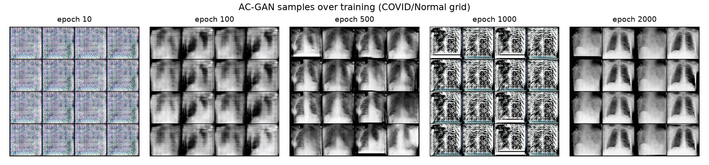
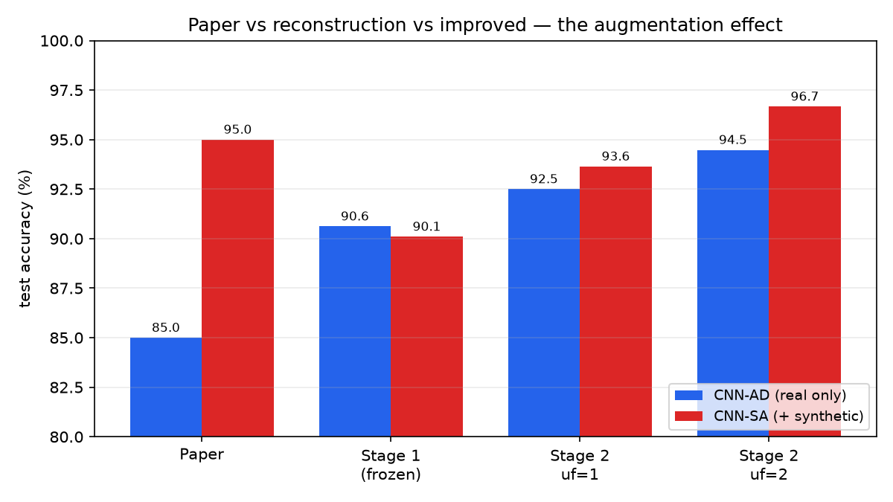

# Reproducing, Diagnosing, and Rescuing the CovidGAN Claim
### — Validated on a Second Dataset (Condensed) —
**Final Project, Part 2 — Joint Report**

**Hila Fishman · Maya Hayat**

Reconstruction, diagnosis, and improvement of Waheed et al., *"CovidGAN: Data Augmentation Using Auxiliary Classifier GAN for Improved Covid-19 Detection"*, IEEE Access, vol. 8, 2020.

> **Editing note.** Text wrapped like **🔴 [DDSM-only] …** marks a result currently established *only* on the DDSM (second) dataset, still awaiting a CovidGAN counterpart. In the LaTeX these are the bold-red `\ddsmonly{}` spans.

**Overview.** We reconstruct the paper's AC-GAN + VGG16 COVID-19 detector and find that its central claim — a **+10-point accuracy lift** from GAN augmentation — **does not reproduce** (§3). The rest of the report diagnoses *why* and fixes it (§4–§5), and — to check that the failure is not just an artifact of our particular COVID dataset — **re-runs the same pipeline on a second dataset** (CBIS-DDSM mammography), reporting the DDSM result alongside each main CovidGAN claim. A result currently established *only* on DDSM (still awaiting a CovidGAN counterpart) is flagged **🔴 [DDSM-only]**. CovidGAN is the primary dataset and leads every experiment; DDSM numbers are from Weights & Biases (`maya-hayat-ariel-university/ddsm-acgan`).

---

## 1. Original architecture

The pipeline has two models: an **AC-GAN** that synthesizes chest-X-ray (CXR) images and a **VGG16-based classifier** that detects COVID-19; synthetic images augment the classifier's training set (Figure 1).

**(a) AC-GAN generator** — fuses noise + label and upsamples 7→112 through four transpose-conv blocks (~22M params).
**(b) AC-GAN discriminator** — downsamples to 7×7×512 and splits into the two AC-GAN heads: validity (real/fake) and class (COVID/Normal) (~2M).
**(c) VGG16 detector** — a *frozen* ImageNet VGG16 + small head; only ~33K of ~14.7M params train, per the paper.

> **Figure 1.** Block view of the three models. (See `stage2/results/figures/` — architecture diagram is drawn in TikZ in the LaTeX version.)

**Losses / hyperparameters.** GAN objective: `BCEWithLogits` (validity) + `CrossEntropy` (class) for both *D* and *G*, one-sided label smoothing (real target 0.9); classifier: `CrossEntropy`. GAN trained batch 64, Adam `lr=2e-4`, β₁=0.5, **2000 epochs**; classifier batch 16, Adam `lr=1e-3`, images 112×112. Paper split: train COVID/Normal 331/601, **test 72/120 (192)**.

---

## 2. Paper results (the target)

Accuracy on the held-out 192-image real test set, in two configurations reused throughout: **CNN-AD** (real data only) and **CNN-SA** (real + synthetic).

| Configuration | Accuracy |
|---|---|
| CNN-AD (real only) | **85%** |
| CNN-SA (+ synthetic) | **95%** |

The claim under test is the **+10-point** lift (CNN-SA − CNN-AD), concentrated in COVID recall. *Metrics:* **accuracy** (paper's) = correct/total on real test; **recall** = TP/(TP+FN) per class (the clinically meaningful axis, studied in class); **FID** (studied in class) judges *generator* realism (lower = better); a **transfer probe** (train on synthetic alone, test on real) judges whether synthetic carries real class signal. A recurring finding: none of these generator-side measures predicts downstream value.

---

## 3. Reconstruction results — the claim does not reproduce

We reimplemented the pipeline in PyTorch, trained the GAN for the paper's 2000 epochs, generated a synthetic pool (1669 COVID + 1399 Normal), and evaluated on the 192-image real test set.

| Configuration | Paper | Our reconstruction |
|---|---|---|
| CNN-AD (real only) | 85.00% | **90.62%** |
| CNN-SA (+ synthetic) | 95.00% | **90.10%** |
| Augmentation lift | +10.00 | **−0.52 (flat)** |

Two anomalies: **(A)** our baseline is *higher* than the paper's (90.6% vs 85%), and **(B)** augmentation is **flat**, not +10. We ruled out the trivial explanations and then diagnosed each.

**Not a bug, not a data-pipeline error.** A layer-by-layer audit confirms the reconstruction matches the paper (VGG16 frozen, only ~33K trainable params) — so the anomalies are not an implementation bug — and we verified the dataset pipeline itself is correct (right sources, de-duplication, and the paper's 331/601 train, 72/120 test split) — so they are not a data-loading error either.

**Anomaly A — why the baseline is higher.** Our working hypothesis is that the **data available today is cleaner and more separable** than the paper's 2020 hand-merged set: the modern Kaggle CXR database has been re-released several times and the authors published no manifest of their exact selection, so their original set is *not reproducible*. Crucially, matching only the *number* of images (403/721) is **not enough** — the images themselves are easier — so our detector does legitimate but easier classification (COVID recall 0.69→0.89), with no room for a +10 gain.

**Anomaly B — why augmentation is flat.** Two diagnostics:

- **The synthetic pool carries no transferable pathology.** A classifier trained on the synthetic pool *alone* scores **55.2%** on real test (COVID recall 0.22) — *below* the 62.5% majority floor. The AC-GAN stamped an easy class-conditioned **"fingerprint"** (a global brightness style; plainly visible in Figure 2), not real pathology.
- **Image quality is not the cap.** FID roughly *halved* from the 25-epoch to the 2000-epoch generator (504.4→272.7) with *no* downstream change — so generation quality is not what limits augmentation.

> **Figure 2. The fingerprint, seen.** 2000-epoch AC-GAN samples: the COVID tiles (columns 1 & 3) are *conspicuously brighter* than the darker, sharper Normal tiles (columns 2 & 4) — a whole-image brightness difference anyone can spot at a glance. On *real* data class-mean brightness differs by only ~3.5%; the GAN turned a faint tendency into a deterministic rule.

**Real detail vs. fake fingerprint (no contradiction).** A separate check — blurring the *real* images — collapses accuracy and COVID recall, so the classifier depends on *fine* detail genuinely present in real X-rays. The fakes lack exactly that fine detail (only the coarse brightness tag), so the two findings *agree* and jointly explain the flat result: the real task is won on fine pathology, which the synthetic images do not supply.

**Diagnosis → two fixes, and a second dataset.** Anomaly B has two blockers: a **fingerprinting GAN** and a **frozen classifier head** with no capacity to use new data. §4 fixes both. And because anomaly A is a hypothesis about *our data*, we test it directly: if the reproduction failure were an artifact of our cleaner COVID set, it should behave differently on a different one. So we **re-run the entire pipeline on a second dataset of the same kind of task** — **CBIS-DDSM** benign-vs-malignant mammography (a static, versioned benchmark; 1,318 train / 378 test ROIs; two data bugs fixed first — mask contamination and 16-bit grayscale truncation) — and report DDSM alongside every main claim below.

---

## 4. Improved architecture

Stage 1 surfaced two bottlenecks, so we improve on two fronts (all drawn from the assignment's allowed modifications):

- **Track A — the classifier (fix the frozen head).** Unfreeze the top VGG16 conv block(s) (trainable params 33K → 7.11M at uf=1 → 13.01M at uf=2) and add a **BatchNorm head**, trained with **discriminative learning rates** (head `1e-3`, backbone `1e-5`) so ImageNet filters adapt without being destroyed on ~900 images.
- **Track B — the generator (kill the fingerprint).** Raise the latent noise *z* ~ 𝒩(0, 0.02) → 𝒩(0, 1) (0.02 nearly switches the noise off, collapsing *G* to one prototype per class); add **DiffAugment** + **spectral norm** (small-data stability); and replace the auxiliary class head with a **projection discriminator**, which removes the fingerprint incentive at its root.

The architecture (layer shapes, ~22M G / ~2M D) is otherwise unchanged, so gains are attributable to the recipe, not a bigger model. On DDSM the *same two axes* are applied: the GAN improvement there is **spectral norm + kernel 5→4/stride 2** (a different recipe reaching the same goal), and the identical unfreeze-the-encoder change.

---

## 5. Improved results — main claims (CovidGAN + DDSM)

Each claim states the CovidGAN result first, then the DDSM check on independent data.

### Claim 1 — unfreezing the classifier raises the baseline *and* revives augmentation

CovidGAN, mean ± std over **5 seeds** (paper/reconstruction are single runs):

| Model | CNN-AD | CNN-SA | Lift |
|---|---|---|---|
| Paper (Waheed et al.) | 85.00% | 95.00% | +10.00 |
| Reconstruction (frozen) | 90.62% | 90.10% | −0.52 (flat) |
| Improved / uf=1 | 92.50 ± 0.71 | 93.65 ± 1.16 | **+1.15** |
| Improved / uf=2 | **94.48 ± 0.97** | **96.67 ± 0.71** | **+2.19** |

Unfreezing raised the baseline (90.6→94.5%) *and* restored the lift; at uf=2, **CNN-SA 96.67% edges past the paper's 95%** (COVID-recall lift +3.33, larger than each arm's seed spread). *Data-scarcity sweep:* the lift is positive at every real-data fraction and largest in the low-to-mid regime (peak +3.30 at 25% real), consistent with the paper's "augmentation rescues data-starved models" reading and explaining why our full-data lift is ~+2, not +10.

**Second dataset (DDSM): holds.** Unfreezing raises the DDSM baseline identically — frozen AD 66.00% → unfrozen AD 69.45% (+3.45, both seeds) — and with the unfrozen classifier, baseline-GAN augmentation gives DDSM's first fully reproducible augmentation win (70.77% > 69.45% at both seeds). Capacity is the precondition for augmentation to help, on both datasets.

> **Figure 3.** Paper vs. reconstruction vs. improved (CovidGAN). Frozen Stage 1 shows no augmentation gain; both improved variants raise the baseline and restore a positive lift, uf=2 CNN-SA edging past the paper's 95%.

### Claim 2 — the improved GAN carries real transferable signal (not a fingerprint)

CovidGAN generator quality vs. transfer probe (floor = 62.5%):

| Generator | FID | Transfer-probe acc. |
|---|---|---|
| Stage-1 AC-GAN, 2000 ep (noise 0.02) | 272.7 | **55.2%** (below floor) |
| Improved AC-GAN, 300 ep | 225.7 | 72.9% |
| Projection discriminator, 300 ep | 155.0 | 74.5% |
| **Projection discriminator, 600 ep** | **121.3** | **81.3%** |

Raising the noise to 1.0 is the biggest lever (55→73%); the projection discriminator is the least-fingerprinted generator and at 300 ep already beats the Stage-1 AC-GAN at 2000 ep by ~43% FID. **Second dataset (DDSM): holds** — the spectral-norm + kernel/stride GAN cut loss variance ~10–30× and moved synthetic malignant samples into overlap with the real-malignant PCA region (a de-fingerprinted, more stable generator, reached via a different intervention).

### Claim 3 — a better generator does not (necessarily) help the classifier

This is the project's most surprising result. On CovidGAN, taking the projection pool 300→600 epochs (FID 155→121, transfer 74.5→81.3% — better by *every* generator-side metric) moved downstream accuracy the *wrong* way (single seed):

| Classifier | AD | SA + Proj 300 | SA + Proj 600 |
|---|---|---|---|
| frozen | 90.62% | 90.10% | **88.54%** |
| unfrozen (uf=2) | 95.31% | 97.40% | **93.75%** |

Lower FID *and* higher transfer, yet downstream dropped — **GAN quality metrics do not predict downstream augmentation value.**

**🔴 [DDSM-only]** Second dataset (DDSM): the same reversal, established at *two seeds* with a mechanism probe — the improved GAN helps at matched epochs but *hurts* the unfrozen classifier (66.67% < baseline-GAN 70.77% and < AD 69.45%, both seeds). This currently leads on DDSM: the CovidGAN reversal is only single-seed with no mechanism probe, so a multi-seed CovidGAN run + a synthetic-only probe of the projection 300-vs-600 pools still needs to be added.

### Claim 4 — both fixes are required (and the GAN gain needs capacity)

CovidGAN {improved AC-GAN, projection} pool × {frozen, unfrozen} classifier (single seed; the uf=2 lift itself is 5-seed confirmed at +2.19):

| Classifier | AD | SA + AC-GAN | SA + Projection |
|---|---|---|---|
| frozen | 90.62% | 90.10% | 90.10% |
| unfrozen | 95.31% | **97.92%** | 97.40% |

Better GANs help **only when the encoder is unfrozen**; under the frozen head they stay flat, and with scarce real data they actively *hurt* (acc lift −1.9 at 100% real → −8.2 at 10%). **Neither fix alone reproduces the paper's benefit.** **Second dataset (DDSM): holds** — the analogous capacity × GAN-source grid shows the same structure (flat under the frozen head, a reproducible win only once unfrozen).

**🔴 [DDSM-only], CovidGAN counterpart to add:** On DDSM, improving the GAN architecture produced a clean *downstream* gain at matched epochs (baseline-GAN SA 60.05% → improved-GAN SA 66.93%, **+6.9**, vs. real-only AD 64.02%) — a case where a generation-quality improvement *did* translate downstream, because that classifier is far from ceiling. **🔴** We do not yet have the matched CovidGAN experiment isolating an improved-GAN downstream gain at equal epochs; it should be run and inserted here. Likewise the DDSM capacity grid and the Claim 3 reversal are at two seeds while CovidGAN's are single-seed — **🔴** the CovidGAN grid needs re-running multi-seed (`stage2/multiseed.py`) to match DDSM's power.

---

## 6. Discussion

**The failure is not an artifact of our COVID data.** The naive +10 setup failed on *both* datasets, and every CovidGAN conclusion we checked on DDSM held on independent data. So the failure to reproduce is a property of the *method under these conditions*, not of our particular dataset. The paper's claim reproduces *in kind, not in magnitude*: +2.19 on COVID (uf=2), and on DDSM the first reproducible win plus a +6.9 matched-epoch GAN gain.

**Generation quality does not predict downstream benefit.** On COVID, FID halved and the transfer probe rose 55→81% with zero-or-negative downstream change; on DDSM a far more stable, better-aligned generator hurt the high-capacity classifier. Both datasets independently produced the same reversal — only an AD-vs-SA comparison measures the paper's actual claim.

**Two knobs govern whether augmentation helps.** *Capacity*: unfreezing the encoder raised the baseline on both datasets and is the precondition for any augmentation gain. *Headroom*: the +10 is a data-starved, low-baseline regime, reproducible in kind but not in magnitude on data (either dataset) that is not starved.

**Limitations & future work.** Close the CovidGAN gaps flagged in **🔴 red** above (multi-seed the reversal and the capacity × GAN grid; add the matched improved-GAN downstream comparison); unify the improved-GAN recipe across datasets and run one shared multi-seed grid; replicate the scarcity sweep on DDSM; and validate on an independent public CXR set to fully settle anomaly A. Full derivations, all eight controlled tests, and reproduce commands are in the long-form report and repo logs (`REPORT.md`, `SESSION_FINDINGS.md`).

---

## References

1. A. Waheed et al., "CovidGAN: Data Augmentation Using Auxiliary Classifier GAN for Improved Covid-19 Detection," *IEEE Access*, vol. 8, 2020.
2. A. Odena, C. Olah, J. Shlens, "Conditional Image Synthesis with Auxiliary Classifier GANs," *ICML*, 2017.
3. T. Miyato, M. Koyama, "cGANs with Projection Discriminator," *ICLR*, 2018.
4. T. Miyato et al., "Spectral Normalization for GANs," *ICLR*, 2018.
5. S. Zhao et al., "Differentiable Augmentation for Data-Efficient GAN Training," *NeurIPS*, 2020.
6. A. Odena, V. Dumoulin, C. Olah, "Deconvolution and Checkerboard Artifacts," *Distill*, 2016.
7. K. Simonyan, A. Zisserman, "Very Deep Convolutional Networks" (VGG16), *ICLR*, 2015.
8. M. Heusel et al., "GANs Trained by a Two Time-Scale Update Rule" (FID), *NeurIPS*, 2017.
9. T. Rahman, M. E. H. Chowdhury et al., "COVID-19 Radiography Database," Kaggle.
10. R. S. Lee et al., "A curated mammography data set" (CBIS-DDSM), *Scientific Data*, 2017.
